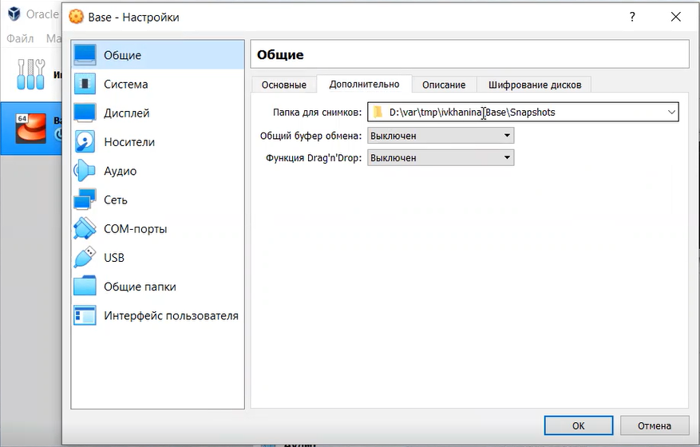

---
# Front matter
title: "Отчёт по лабораторной работе №1"
subtitle: "Установка и конфигурация операционной системы на виртуальную машину"
author: "Ханина Ирина Владимировна, НБИбд-02-18"

# Generic otions
lang: ru-RU
toc-title: "Содержание"

# Bibliography
bibliography: bib/cite.bib
csl: pandoc/csl/gost-r-7-0-5-2008-numeric.csl

# Pdf output format
toc: true # Table of contents
toc_depth: 2
lof: true # List of figures
lot: true # List of tables
fontsize: 12pt
linestretch: 1.5
papersize: a4
documentclass: scrreprt
## I18n
polyglossia-lang:
  name: russian
  options:
	- spelling=modern
	- babelshorthands=true
polyglossia-otherlangs:
  name: english
### Fonts
mainfont: PT Serif
romanfont: PT Serif
sansfont: PT Sans
monofont: PT Mono
mainfontoptions: Ligatures=TeX
romanfontoptions: Ligatures=TeX
sansfontoptions: Ligatures=TeX,Scale=MatchLowercase
monofontoptions: Scale=MatchLowercase,Scale=0.9
## Biblatex
biblatex: true
biblio-style: "gost-numeric"
biblatexoptions:
  - parentracker=true
  - backend=biber
  - hyperref=auto
  - language=auto
  - autolang=other*
  - citestyle=gost-numeric
## Misc options
indent: true
header-includes:
  - \linepenalty=10 # the penalty added to the badness of each line within a paragraph (no associated penalty node) Increasing the value makes tex try to have fewer lines in the paragraph.
  - \interlinepenalty=0 # value of the penalty (node) added after each line of a paragraph.
  - \hyphenpenalty=50 # the penalty for line breaking at an automatically inserted hyphen
  - \exhyphenpenalty=50 # the penalty for line breaking at an explicit hyphen
  - \binoppenalty=700 # the penalty for breaking a line at a binary operator
  - \relpenalty=500 # the penalty for breaking a line at a relation
  - \clubpenalty=150 # extra penalty for breaking after first line of a paragraph
  - \widowpenalty=150 # extra penalty for breaking before last line of a paragraph
  - \displaywidowpenalty=50 # extra penalty for breaking before last line before a display math
  - \brokenpenalty=100 # extra penalty for page breaking after a hyphenated line
  - \predisplaypenalty=10000 # penalty for breaking before a display
  - \postdisplaypenalty=0 # penalty for breaking after a display
  - \floatingpenalty = 20000 # penalty for splitting an insertion (can only be split footnote in standard LaTeX)
  - \raggedbottom # or \flushbottom
  - \usepackage{float} # keep figures where there are in the text
  - \floatplacement{figure}{H} # keep figures where there are in the text
---

# Цель работы

Приобретение практических навыков установки операционной системы на виртуальную машину, настройки минимально необходимых для дальнейшей работы сервисов.

# Задание

Установить операционную систему Linux на виртуальную машину VirtualBox и задать минимально необходимые настройки для дальнейшей работы сервисов.

# Теоретическое введение

VirtualBox представляет собой программное обеспечение для виртуализации. VirtualBox - кроссплатформенное приложение. Это значит, что, во-первых, оно устанавливается на существующие компьютеры на базе Intel или AMD, независимо от того, работают ли они под управлением операционных систем Windows, Mac OS X, Linux или Oracle Solaris, а, 
во - вторых, расширяет возможности существующего компьютера, позволяя ему одновременно запускать несколько операционных систем внутри нескольких виртуальных машин [[1]](https://docs.oracle.com/en/virtualization/virtualbox/6.1/user/Introduction.html) . Возможна установка и запуск стольких виртуальных машин, сколько пользователь захочет. Единственные ограничения - это дисковое пространство и память. 

Виртуализация имеет следующие преимущества [[1]](https://docs.oracle.com/en/virtualization/virtualbox/6.1/user/Introduction.html) :

1. Одновременный запуск нескольких операционных систем.
2. Более простая установка программного обеспечения.
3. Раздельность реального и виртуальных компьютеров. Работая в виртуальной ОС, можно не бояться возможности нанесения вреда основной ОС, т.к. виртуальная система полностью отграничена от основной системы.
4. Тестирование и аварийное восстановление. Виртуальную машину и ее виртуальные жесткие диски можно рассматривать как контейнер, который можно произвольно замораживать, пробуждать, копировать, создавать резервные копии и перемещать между хостами. К тому же имеется возможность сделать так называемые моментальные снимки, тем самым сохранить определенное состояние виртуальной машины и при необходимости вернуться к этому состоянию.
5. Консолидация инфраструктуры. Виртуализация помогает сократить расходы на оборудование и электроэнергию.

Как было сказано выше, на VirtualBox можно установить разные ОС. Среди них могут быть Linux, Windows, Mac и другие. В данной лабораторной работе предполагается установка Linux, дистрибутив CentOS. Дистрибутив CentOS Linux представляет собой стабильную, предсказуемую, управляемую и воспроизводимую платформу, полученную из источников Red Hat Enterprise Linux (RHEL) [[2]](https://www.centos.org/about/). Отличительными чертами CentOS является ее высокая стабильность и длительные сроки поддержки. Рассмотрим ключевые особенности CentOS 7: 

1. Седьмая версия CentOS разработана на ядре Linux версии 3.10. Ключевой особенностью CentOS 7 можно считать поддержку контейнеров. 
2. CentOS 7 включает в себя HTTP-сервер Apache версии 2.4. Новые функции в Apache HTTP 2.4 обеспечивают улучшенную асинхронную обработку запросов, встроенную поддержку FastCGI в mod_proxy и поддержку скриптов Lua. 
3. На смену SysV пришел новый системный/сервисный менеджер — Systemd.
4. Cистема управления базами данных MySQL была заменена на форк MariaDB. 
5. Согласно заявлению разработчиков, CentOS 7 будет поддерживать обновления до июля 2024 г. [[3]](https://market.cnews.ru/news/top/2020-04-24_obzor_operatsionnoj_sistemy).

Изучив основные теоретические аспекты, перейдем к практической части выполнения лабораторной работы - установке операционную систему Linux, дистрибутив Centos на виртуальную машину VirtualBox и заданию минимально необходимых настроек для дальнейшей работы сервисов.

# Выполнение лабораторной работы

Перед началом выполнения лабораторной работы я скачала виртуальную машину VirtualBox, а также создала необоходимые папки: var, tmp и ikhanina. Затем я скопировала заранее скачанный образ виртуальной машины в созданный каталог ([рис. 1](image/1.png)).

{ #fig:001 width=70% }

Я запустила виртуальную машину ([рис. 2](image/2.png)).

{ #fig:002 width=70% }

Я проверила в свойствах VirtualBox месторасположение каталога для виртуальных машин. Для этого в VirtualBox перешла в Настройки, вкладка Общие, и изменила значение поля Папка для машин ([рис. 3](image/3.png)).

{ #fig:003 width=70% }

Для того, чтобы создать новую виртуальную машину, в VirtualBox я выбрала Машина и нажала Создать. Указала имя новой виртуальной машины — Base, тип операционной системы — Linux, RedHat ([рис. 4](image/4.png)). Указала размер основной памяти виртуальной машины - 1024 МБ ([рис. 5](image/5.png)). Задала конфигурацию жёсткого диска — загрузочный ([рис. 6](image/6.png)), VDI (BirtualBoxDisk Image) ([рис. 7](image/7.png)), выбрала динамический виртуальный диск ([рис. 8](image/8.png)). Задала размер диска — 40 ГБ и его расположение — "/var/tmp/ivkhanina/Base/Base.vdi" ([рис. 9](image/9.png)).

{ #fig:004 width=70% }

{ #fig:005 width=70% }[

{ #fig:006 width=70% }

{ #fig:007 width=70% }

{ #fig:008 width=70% }

{ #fig:009 width=70% }

Далее я зашла в Настройки, Общие, вкладка Дополнительные, и проверила, что все снимки виртуальной машины будут иметь путь "D:/var/tmp/ivkhanina/Base/Snapshots" ([рис. 10](image/10.png)). 

{ #fig:010 width=70% }

Перейдя во вкладку Носители, добавила новый привод оптических дисков и выбрала образ CentOS-7-x86_64-DVD-2009.iso ([рис. 11](image/11.png), [рис. 12](image/12.png))

{ #fig:011 width=70% }

{ #fig:012 width=70% }

Запустила виртуальную машину Base и нажала "Install CentOS 7" ([рис. 13](image/13.png)).

{ #fig:013 width=70% }

После запуска я установила русский язык для интерфейса ([рис. 14](image/14.png)), указала часовой пояс Москва ([рис. 15](image/15.png)), выбрала дополнительно английский язык ([рис. 16](image/11.png)) и настроила раскладку клавиатуры ([рис. 17](image/17.png)).

{ #fig:014 width=70% }

{ #fig:015 width=70% }

{ #fig:016 width=70% }

{ #fig:017 width=70% }

Произвела выбор программ ([рис. 18](image/18.png)), место установки оставила по умолчанию ([рис. 19](image/19.png)), отключила KDUMP ([рис. 20](image/20.png)), выбрала сеть и указала имя узла ivkhanina.localdomain ([рис. 21](image/21.png)).

{ #fig:018 width=70% }

{ #fig:019 width=70% }

{ #fig:020 width=70% }

{ #fig:021 width=70% }

Затем я установила пароль для root [рис. 22](image/22.png) и создала пользователя ([рис. 23](image/23.png)). Началась установка.

{ #fig:022 width=70% }

{ #fig:023 width=70% }

После успешного завершения установки операционной системыя её перезагрузила ([рис. 24](image/24.png)). Проверила - оптический диск отключился автоматически ([рис. 25](image/25.png)). Затем я приняла лицензию ([рис. 26](image/26.png)). 

{ #fig:024 width=70% }

{ #fig:025 width=70% }

{ #fig:026 width=70% }

Я подключилась к виртуальной машине с помощью созданной учетной записи ([рис. 27](image/27.png)). 

{ #fig:027 width=70% }

Запустила терминал и перешла под учетную запись root с помощью команды su ([рис. 28](image/28.png)).

{ #fig:028 width=70% }

Используя команду yum update я обновила системные файлы [рис. 29](image/29.png). Обновление прошло успешно ([рис. 30](image/291.png), [рис. 31](image/292.png)).

{ #fig:029 width=70% }

{ #fig:030 width=70% }

{ #fig:031 width=70% }

Используя команду yum install mc я установила программу mc ([рис. 32](image/30.png)). Установка прошла успешно ([рис. 33](image/31.png)).

{ #fig:032 width=70% }

{ #fig:033 width=70% }

Для того чтобы другие виртуальные машины могли использовать машину Base и её конфигурацию как базовую, я произвела следующие действия: в VirtualBox в меню выбрала Файл и перешла в Менеджер виртуальных носителей, вкладка Жёсткие диски, и, выделив «Base.dvi», нажала Освободить ([рис. 34](image/32.png)).

{ #fig:034 width=70% }

Теперь на основе виртуальной машины Base я создала машину Host2, указав в качестве имени машины Host2, в качестве типа операционной системы — Linux, версия «RedHat» ([рис. 35](image/33.png)), а при конфигурации виртуального жёсткого диска выбрав «Использовать существующий жёсткий диск» Base.vdi ([рис. 36](image/34.png)).

{ #fig:035 width=70% }

{ #fig:036 width=70% }

Как видим, машина Host2 содалась успешно ([рис. 37](image/35.png)).

{ #fig:037 width=70% }

# Выводы

Я приобрела практические навыки установки операционной системы на виртуальную машину и настройки минимально необходимых для дальнейшей работы сервисов.

# Список литературы{.unnumbered}

1. [Руководство пользователя Oracle VM VirtualBox 6.1](https://docs.oracle.com/en/virtualization/virtualbox/6.1/user/Introduction.html)
2. [About CentOS](https://www.centos.org/about/)
3. [Обзор операционной системы CentOS для виртуальных серверов. История, версии, сравнение с конкурентами](https://market.cnews.ru/news/top/2020-04-24_obzor_operatsionnoj_sistemy)
