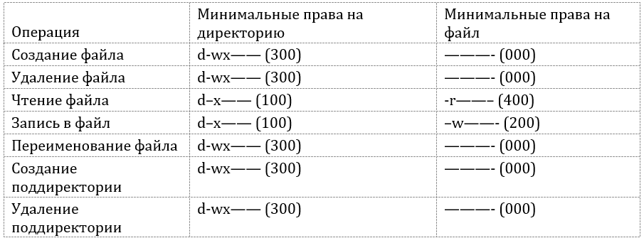

---
## Front matter
lang: ru-RU
title: Дискреционное разграничение прав в Linux. Основные атрибуты
author: Ханина Ирина Владимировна НБИбд-02-18
institute: Российский Университет Дружбы Народов
date: 28 сентября, 2021, Москва, Россия

## Formatting
mainfont: PT Serif
romanfont: PT Serif
sansfont: PT Sans
monofont: PT Mono
toc: false
slide_level: 2
theme: metropolis
header-includes: 
 - \metroset{progressbar=frametitle,sectionpage=progressbar,numbering=fraction}
 - '\makeatletter'
 - '\beamer@ignorenonframefalse'
 - '\makeatother'
aspectratio: 43
section-titles: true

---

## Теоретическое введение 

В Linux, как и в любой многопользовательской системе, возникает задача разграничения доступа субъектов к различным объектам. Один из подходов к разграничению доступа — дискреционный. 
Он предполагает назначение владельцев объектов, которые по собственному усмотрению определяют права доступа субъектов к объектам (директориям или файлам), которыми владеют. 
В операционной системе Linux каждому файлу и директории заданы разрешения доступа для владельца объекта, членов группы владельца объекта и всех остальных пользователей. Права могут быть заданы на:

- чтение (r);
- запись (w);
- выполнение (x).

## Цель лабораторной работы

Цель - получение практических навыков работы в консоли с атрибутами файлов, закрепление теоретических основ дискреционного разграничения доступа в современных системах с открытым кодом на базе ОС Linux.

## Задачи лабораторной работы

1. Создать нового пользователя и войти от его имени в систему.
2. Создать в домашней директории поддиректорию, а в ней файл.
3. Опытным путем изменить атрибуты файла и директории и определить, какие операции разрешены, а какие нет.
4. Заполнить таблицу "Установленные права и разрешенные действия".
5. На её основе определить минимально необходимые права дл выполнения определенных действий внутри созданной директории.

## Результаты выполнения лабораторной работы

Я получила практические навыки работы в консоли с атрибутами файлов, а также закрепила теоретические основы дискреционного разграничения доступа в современных системах с открытым кодом на базе ОС Linux. 

{ #fig:019 width=70% }