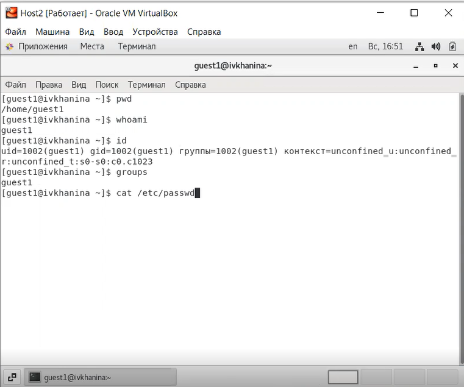
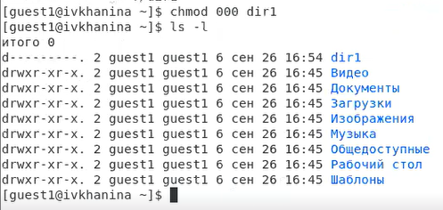

---
# Front matter
title: "Отчёт по лабораторной работе №2"
subtitle: "Дискреционное разграничение прав в Linux. Основные атрибуты"
author: "Ханина Ирина Владимировна, НБИбд-02-18"

# Generic otions
lang: ru-RU
toc-title: "Содержание"

# Bibliography
bibliography: bib/cite.bib
csl: pandoc/csl/gost-r-7-0-5-2008-numeric.csl

# Pdf output format
toc: true # Table of contents
toc_depth: 2
lof: true # List of figures
lot: true # List of tables
fontsize: 12pt
linestretch: 1.5
papersize: a4
documentclass: scrreprt
## I18n
polyglossia-lang:
  name: russian
  options:
	- spelling=modern
	- babelshorthands=true
polyglossia-otherlangs:
  name: english
### Fonts
mainfont: PT Serif
romanfont: PT Serif
sansfont: PT Sans
monofont: PT Mono
mainfontoptions: Ligatures=TeX
romanfontoptions: Ligatures=TeX
sansfontoptions: Ligatures=TeX,Scale=MatchLowercase
monofontoptions: Scale=MatchLowercase,Scale=0.9
## Biblatex
biblatex: true
biblio-style: "gost-numeric"
biblatexoptions:
  - parentracker=true
  - backend=biber
  - hyperref=auto
  - language=auto
  - autolang=other*
  - citestyle=gost-numeric
## Misc options
indent: true
header-includes:
  - \linepenalty=10 # the penalty added to the badness of each line within a paragraph (no associated penalty node) Increasing the value makes tex try to have fewer lines in the paragraph.
  - \interlinepenalty=0 # value of the penalty (node) added after each line of a paragraph.
  - \hyphenpenalty=50 # the penalty for line breaking at an automatically inserted hyphen
  - \exhyphenpenalty=50 # the penalty for line breaking at an explicit hyphen
  - \binoppenalty=700 # the penalty for breaking a line at a binary operator
  - \relpenalty=500 # the penalty for breaking a line at a relation
  - \clubpenalty=150 # extra penalty for breaking after first line of a paragraph
  - \widowpenalty=150 # extra penalty for breaking before last line of a paragraph
  - \displaywidowpenalty=50 # extra penalty for breaking before last line before a display math
  - \brokenpenalty=100 # extra penalty for page breaking after a hyphenated line
  - \predisplaypenalty=10000 # penalty for breaking before a display
  - \postdisplaypenalty=0 # penalty for breaking after a display
  - \floatingpenalty = 20000 # penalty for splitting an insertion (can only be split footnote in standard LaTeX)
  - \raggedbottom # or \flushbottom
  - \usepackage{float} # keep figures where there are in the text
  - \floatplacement{figure}{H} # keep figures where there are in the text
---

# Цель работы

Получение практических навыков работы в консоли с атрибутами файлов, закрепление теоретических основ дискреционного разграничения доступа в современных системах с открытым кодом на базе ОС Linux.

# Задание

Получить практические навыки работы в консоли с атрибутами файлов и закрепить теоретические основы дискреционного разграничения доступа в современных системах с открытым кодом на базе ОС Linux.

# Теоретическое введение

Операционные системы семейства Unix, такие как Linux, отличаются от большинства остальных тем, что они не только многозадачные, но и многопользовательские. Возможность многопользовательской работы глубоко интегрирована в архитектуру операционной системы Linux.
В Linux, как и в любой многопользовательской системе, возникает задача разграничения доступа субъектов к объектам. Один из подходов к разграничению доступа — дискреционный. Он предполагает назначение владельцев объектов, которые по собственному усмотрению определяют 
права доступа субъектов к объектам, которыми владеют. [[2]](https://debianinstall.ru/diskretsionnoe-razgranichenie-dostupa-linux/)

В операционной системе Linux каждому файлу и директории заданы разрешения доступа для владельца файла, членов группы владельца файла и всех остальных пользователей. Права могут быть заданы на:

- чтение (r);
- запись (w);
- выполнение (x).[[1]](https://linuxcommand.ru/razresheniya-dostupa-k-failam/)

Информация о разрешениях в выводе прав доступа содержит символ, определяющий тип файла (-, если обычный файл, d, если директория). Далее идет три набора из трех символов, которые представляют права доступа. 
Первый набор из трех символов указывает права доступа владельца файла, второй — права группы файла, а последний указывает права доступа файла для всех остальных пользователей. [[1]](https://linuxcommand.ru/razresheniya-dostupa-k-failam/)

Сменить разрешения доступа к файлу или директории можно с помощью команды chmod. Для этого нужно указать желаемые настройки прав доступа для файла, файлов или директории, которые нужно изменить.

# Выполнение лабораторной работы

В установленной при выполнении предыдущей лабораторной работы операционной системе с помощью команды useradd guest1, 
используя учётную запись администратора, я создала учётную запись пользователя guest1. ([рис. 1](image/1.png))

{ #fig:001 width=70% }

Далее, используя учётную запись администратора, я задала пароль для пользователя guest1 с помощью команды passwd guest1. ([рис. 2](image/2.png))

{ #fig:002 width=70% }

Я вошла в систему от имени пользователя guest1. ([рис. 3](image/3.png))

{ #fig:003 width=70% }

Запустила терминал, командой pwd определила директорию, в которой я находилась, и сравнила её с приглашением командной строки. Она являлась моей домашней директорией. ([рис. 4](image/4.png))

{ #fig:004 width=70% }

Я уточнила имя пользователя, введя команду whoami. ([рис. 5](image/5.png))

{ #fig:005 width=70% }

Я уточнила имя пользователя, его группу, а также группы, куда входит пользователь, командой id. ([рис. 6](image/6.png)). Выведенные значения uid, gid и др. запомнила. Сравнила вывод id с выводом команды groups: 
команда id выводит id пользователя, id его группы, а также имя группы, куда входит пользователь, а команда groups выводит только имя группы, куда входит пользователь. ([рис. 7](image/7.png)). 
Затем я сравнила полученную информацию об имени пользователя с данными, выводимыми в приглашении командной строки.

{ #fig:006 width=70% }

{ #fig:007 width=70% }

Затем я просмотрела файл /etc/passwd командой cat /etc/passwd ([рис. 8](image/8.png)), нашла в нём свою учётную запись ([рис. 9](image/9.png)). Uid пользователя = 1002, gid пользователя = 1002. Эти значения совпадают с полученными в предыдущих пунктах.

{ #fig:008 width=70% }

{ #fig:009 width=70% }

Я определила существующие в системе директории командой ls -l /home/ ([рис. 10](image/10.png)) и получила список поддиректорий директории /home. На обеих директориях установлены слдующие права: владелец директорий обладает всеми правами (rwx), его группа и остальные пользователи не имеют никаких прав (--- и ---).

{ #fig:010 width=70% }

С помощью команды lsattr /home проверила, какие расширенные атрибуты установлены на поддиректориях, находящихся в директории /home. Мне удалось увидеть расширенные атрибуты директории, но я не смогла увидеть расширенные атрибуты директорий других пользователей. ([рис. 11](image/11.png))

{ #fig:011 width=70% }

Далее я создала в домашней директории поддиректорию dir1, используя команду mkdir dir1. Определила командами ls -l ([рис. 12](image/12.png)) и lsattr ([рис. 13](image/13.png)), какие права доступа и расширенные атрибуты были выставлены на директорию dir1. Владелец директории так же, как и его группа имеют все права (rwx), остальные пользователи имеют только права на чтение и исполнение (r-x).

{ #fig:012 width=70% }

{ #fig:013 width=70% }

Сняла с директории dir1 все атрибуты командой chmod 000 dir1 и проверила правильность выполнения команды с помощью команды ls -l. ([рис. 14](image/14.png))

{ #fig:014 width=70% }

Я попыталась создать в директории dir1 файл file1 командой echo "test" > /home/guest1/dir1/file1. Я получила отказ в выполнении операции по созданию файла, потому что на предыдущем шаге я лишила владельца директории всех прав, включая право на запись (---).
Я не смогла создать файл. Проверила командой ls -l /home/guest/dir1, файл file1 действительно не находится внутри директории dir1. ([рис. 15](image/15.png))

{ #fig:015 width=70% }

Для заполнения таблицы в следующем пункте я создала тестовой файл file1 в директории dir1 для того, чтобы был файл для тестирования некоторых действий. ([рис. 16](image/16.png))

{ #fig:016 width=70% }

Заполнила таблицу «Установленные права и разрешённые действия» [-@tbl:rig-act], выполняя действия от имени владельца директории (файлов), определив опытным путём, какие операции разрешены, а какие нет. Если операция разрешена, я заносила в таблицу знак «+», если не разрешена, знак «-». ([рис. 17](image/17.png))

{ #fig:017 width=70% }

Обозначения в таблице:

(a) Создание файла
(b) Удаление файла
(c) Запись в файл
(d) Чтение файла
(e) Смена директории
(f) Просмотр файлов в директории
(g) Переименование файл
(h) Смена атрибутов файла

: Установленные права и разрешённые действия {#tbl:rig-act}

|   Права директории   |      Права файла     | (a) | (b) | (c) | (d) | (e) | (f) | (g) | (h) |
|:---------------------|:---------------------|-----|-----|-----|-----|-----|-----|-----|-----|
|```d--------- (000)```|```---------- (000)```|  -	|  -  |  -  |  -  |  -	|  -  |  -  |  -  |
|```d--x------ (100)```|```---------- (000)```|  -	|  -  |	 -	|  -  |  +  |  -  |  -  |  +  |
|```d-w------- (200)```|```---------- (000)```|  -	|  -  |	 -  |  -  |  -	|  -  |  -  |  -  |
|```d-wx------ (300)```|```---------- (000)```|  +	|  +  |  -	|  -  |  +  |  -  |  +  |  +  |
|```dr-------- (400)```|```---------- (000)```|  -	|  -  |	 -  |  -  |  -	|  -  |  -  |  -  |
|```dr-x------ (500)```|```---------- (000)```|  -	|  -  |  -	|  -  |  +  |  +  |  -  |  +  |
|```drw------- (600)```|```---------- (000)```|  -	|  -  |  -  |  -  |  -	|  -  |  -  |  -  |
|```drwx------ (700)```|```---------- (000)```|  +	|  +  |	 -	|  -  |  +	|  +  |  +  |  +  |
|```d--------- (000)```|```---x------ (100)```|  -	|  -  |  -  |  -  |  -	|  -  |  -  |  -  |
|```d--x------ (100)```|```---x------ (100)```|  -  |  -  |	 -	|  -  |  +	|  -  |  -  |  +  |
|```d-w------- (200)```|```---x------ (100)```|  -	|  -  |  -  |  -  |  -	|  -  |  -  |  -  |
|```d-wx------ (300)```|```---x------ (100)```|  +	|  +  |	 -	|  -  |  +	|  -  |  +  |  +  |
|```dr-------- (400)```|```---x------ (100)```|  -	|  -  |  -  |  -  |  -	|  -  |  -  |  -  |
|```dr-x------ (500)```|```---x------ (100)```|  -	|  -  |	 -	|  -  |  +	|  +  |  -  |  +  |
|```drw------- (600)```|```---x------ (100)```|  -	|  -  |  -  |  -  |  -	|  -  |  -  |  -  |
|```drwx------ (700)```|```---x------ (100)```|  +	|  +  |	 -	|  -  |  +	|  +  |  +  |  +  |
|```d--------- (000)```|```--w------- (200)```|  -	|  -  |  -  |  -  |  -	|  -  |  -  |  -  |
|```d--x------ (100)```|```--w------- (200)```|  -	|  -  |	 +	|  -  |  +	|  -  |  -  |  +  |
|```d-w------- (200)```|```--w------- (200)```|  -	|  -  |  -  |  -  |  -	|  -  |  -  |  -  |
|```d-wx------ (300)```|```--w------- (200)```|  +	|  +  |	 +	|  -  |  +	|  -  |  +  |  +  |
|```dr-------- (400)```|```--w------- (200)```|  -	|  -  |  -  |  -  |  -	|  -  |  -  |  -  |
|```dr-x------ (500)```|```--w------- (200)```|  -	|  -  |	 +  |  -  |  +	|  +  |  -  |  +  |
|```drw------- (600)```|```--w------- (200)```|  -	|  -  |  -  |  -  |  -	|  -  |  -  |  -  |
|```drwx------ (700)```|```--w------- (200)```|  +	|  +  |	 +	|  -  |  +	|  +  |  +  |  +  |
|```d--------- (000)```|```--wx------ (300)```|  -	|  -  |  -  |  -  |  -	|  -  |  -  |  -  |
|```d--x------ (100)```|```--wx------ (300)```|  -	|  -  |	 +	|  -  |  +	|  -  |  -  |  +  |
|```d-w------- (200)```|```--wx------ (300)```|  -	|  -  |  -  |  -  |  -	|  -  |  -  |  -  |
|```d-wx------ (300)```|```--wx------ (300)```|  +  |  +  |	 +  |  -  |  +  |  -  |  +  |  +  |
|```dr-------- (400)```|```--wx------ (300)```|  -	|  -  |  -  |  -  |  -	|  -  |  -  |  -  |
|```dr-x------ (500)```|```--wx------ (300)```|  -  |  -  |	 +	|  -  |  +	|  +  |  -  |  +  |
|```drw------- (600)```|```--wx------ (300)```|  -	|  -  |  -  |  -  |  -	|  -  |  -  |  -  |
|```drwx------ (700)```|```--wx------ (300)```|  +	|  +  |	 +	|  -  |  +	|  +  |  +  |  +  |
|```d--------- (000)```|```-r-------- (400)```|  -	|  -  |  -  |  -  |  -	|  -  |  -  |  -  |
|```d--x------ (100)```|```-r-------- (400)```|  -	|  -  |	 -	|  +  |  +	|  -  |  -  |  +  |
|```d-w------- (200)```|```-r-------- (400)```|  -	|  -  |  -  |  -  |  -	|  -  |  -  |  -  |
|```d-wx------ (300)```|```-r-------- (400)```|  +	|  +  |	 -	|  +  |  +	|  -  |  +  |  +  |
|```dr-------- (400)```|```-r-------- (400)```|  -	|  -  |  -  |  -  |  -	|  -  |  -  |  -  |
|```dr-x------ (500)```|```-r-------- (400)```|  -  |  -  |	 -	|  +  |  +  |  +  |  -  |  +  |
|```drw------- (600)```|```-r-------- (400)```|  -	|  -  |  -  |  -  |  -	|  -  |  -  |  -  |
|```drwx------ (700)```|```-r-------- (400)```|  +	|  +  |	 -	|  +  |  +	|  +  |  +  |  +  |
|```d--------- (000)```|```-r-x------ (500)```|  -	|  -  |  -  |  -  |  -	|  -  |  -  |  -  |
|```d--x------ (100)```|```-r-x------ (500)```|  -	|  -  |	 -	|  +  |  +	|  -  |  -  |  +  |
|```d-w------- (200)```|```-r-x------ (500)```|  -	|  -  |  -  |  -  |  -	|  -  |  -  |  -  |
|```d-wx------ (300)```|```-r-x------ (500)```|  +	|  +  |	 -  |  +  |  +	|  -  |  +  |  +  |
|```dr-------- (400)```|```-r-x------ (500)```|  -	|  -  |  -  |  -  |  -	|  -  |  -  |  -  |
|```dr-x------ (500)```|```-r-x------ (500)```|  -	|  -  |	 -	|  +  |  +	|  +  |  -  |  +  |
|```drw------- (600)```|```-r-x------ (500)```|  -	|  -  |  -  |  -  |  -	|  -  |  -  |  -  |
|```drwx------ (700)```|```-r-x------ (500)```|  +	|  +  |	 -	|  +  |  +	|  +  |  +  |  +  |
|```d--------- (000)```|```-rw------- (600)```|  -	|  -  |  -  |  -  |  -	|  -  |  -  |  -  |
|```d--x------ (100)```|```-rw------- (600)```|  -	|  -  |  +	|  +  |  +	|  -  |  -  |  +  |
|```d-w------- (200)```|```-rw------- (600)```|  -	|  -  |  -  |  -  |  -	|  -  |  -  |  -  |
|```d-wx------ (300)```|```-rw------- (600)```|  +	|  +  |	 +	|  +  |  +	|  -  |  +  |  +  |
|```dr-------- (400)```|```-rw------- (600)```|  -	|  -  |  -  |  -  |  -	|  -  |  -  |  -  |
|```dr-x------ (500)```|```-rw------- (600)```|  -  |  -  |	 +	|  +  |  +	|  +  |  -  |  +  |
|```drw------- (600)```|```-rw------- (600)```|  -	|  -  |  -  |  -  |  -	|  -  |  -  |  -  |
|```drwx------ (700)```|```-rw------- (600)```|  +  |  +  |	 +	|  +  |  +	|  +  |  +  |  +  |
|```d--------- (000)```|```-rwx------ (700)```|  -	|  -  |  -  |  -  |  -	|  -  |  -  |  -  |
|```d--x------ (100)```|```-rwx------ (700)```|  -  |  -  |	 +	|  +  |  +	|  -  |  -  |  +  |
|```d-w------- (200)```|```-rwx------ (700)```|  -	|  -  |  -  |  -  |  -	|  -  |  -  |  -  |
|```d-wx------ (300)```|```-rwx------ (700)```|  +  |  +  |	 +	|  +  |  +	|  -  |  +  |  +  |
|```dr-------- (400)```|```-rwx------ (700)```|  -	|  -  |  -  |  -  |  -	|  -  |  -  |  -  |
|```dr-x------ (500)```|```-rwx------ (700)```|  -  |  -  |	 +	|  +  |  +	|  +  |  -  |  +  |
|```drw------- (600)```|```-rwx------ (700)```|  -	|  -  |  -  |  -  |  -	|  -  |  -  |  -  |
|```drwx------ (700)```|```-rwx------ (700)```|  +  |  +  |	 +	|  +  |  +	|  +  |  +  |  +  |

На основании заполненной таблицы определила те или иные минимально необходимые права для выполнения операций внутри директории dir1 и заполнила таблицу [-@tbl:min-rig]. Для заполнения последних двух строк опытным путем проверила минимальные права. ([рис. 18](image/18.png))

{ #fig:018 width=70% }

: Минимальные права для совершения операций {#tbl:min-rig}

|        Операция        | Минимальные права на директорию | Минимальные права на файл |
|------------------------|---------------------------------|---------------------------|
|     Создание файла     |           d-wx------ (300)      |      ---------- (000)     |	    
|     Удаление файла     |           d-wx------ (300)      |      ---------- (000)     |
|      Чтение файла      |           d--x------ (100)      |      -r-------- (400)     |
|      Запись в файл     |           d--x------ (100)      |      --w------- (200)     |
|  Переименование файла  |           d-wx------ (300)      |      ---------- (000)     |
| Создание поддиректории |           d-wx------ (300)      |      ---------- (000)     |
| Удаление поддиректории |           d-wx------ (300)      |      ---------- (000)     |

# Выводы

Я получила практические навыки работы в консоли с атрибутами файлов, а также закрепила теоретические основы дискреционного разграничения доступа в современных системах с открытым кодом на базе ОС Linux.

# Список литературы{.unnumbered}

1. [Разрешения доступа к файлам](https://linuxcommand.ru/razresheniya-dostupa-k-failam/)
2. [Дискреционное разграничение доступа Linux](https://debianinstall.ru/diskretsionnoe-razgranichenie-dostupa-linux/)

