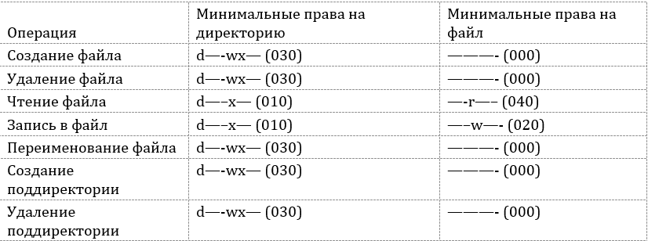

---
## Front matter
lang: ru-RU
title: Дискреционное разграничение прав в Linux. Два пользователя
author: Ханина Ирина Владимировна НБИбд-02-18
institute: Российский Университет Дружбы Народов
date: 08 октября, 2021, Москва, Россия

## Formatting
mainfont: PT Serif
romanfont: PT Serif
sansfont: PT Sans
monofont: PT Mono
toc: false
slide_level: 2
theme: metropolis
header-includes: 
 - \metroset{progressbar=frametitle,sectionpage=progressbar,numbering=fraction}
 - '\makeatletter'
 - '\beamer@ignorenonframefalse'
 - '\makeatother'
aspectratio: 43
section-titles: true

---

## Теоретическое введение 

Системы Linux издавна считаются наиболее пригодными в качестве многопользовательских сред. Концепции их построения таковы, что любой файл в системе 
обязательно должен принадлежать какому-нибудь пользователю. Такой подход к к разграничению доступа называется дискреционным. 
Он обеспечивает высокую надежность системы и безопасность ее файлов. В операционной системе Linux каждому файлу и директории заданы разрешения доступа для владельца объекта, членов группы владельца объекта и всех остальных пользователей. Права могут быть заданы на:

- чтение (r);
- запись (w);
- выполнение (x).

## Цель лабораторной работы

Цель - получение практических навыков работы в консоли с атрибутами файлов для групп пользователей.

## Задачи лабораторной работы

1. Создать 2 новых пользователей и войти от их имен в систему на двух консолях.
2. Зарегистрировать пользователя guest2 в группе guest1.
3. Опытным путем изменять атрибуты файла и директории от пользователя guest1 и определять, какие операции разрешены, а какие нет, от пользователя guest2.
4. Заполнить таблицу "Установленные права и разрешенные действия для групп".
5. На её основе определить минимально необходимые права для выполнения определенных действий внутри созданной директории.

## Результаты выполнения лабораторной работы

Я получила практические навыки работы в консоли с атрибутами файловдля групп пользователей. 

{ #fig:008 width=70% }