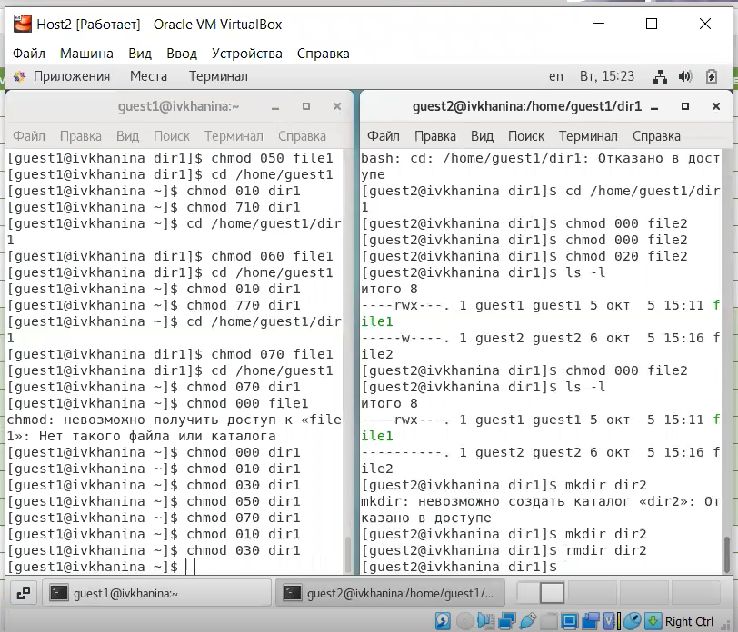

---
# Front matter
title: "Отчёт по лабораторной работе №3"
subtitle: "Дискреционное разграничение прав в Linux. Два пользователя"
author: "Ханина Ирина Владимировна, НБИбд-02-18"

# Generic otions
lang: ru-RU
toc-title: "Содержание"

# Bibliography
bibliography: bib/cite.bib
csl: pandoc/csl/gost-r-7-0-5-2008-numeric.csl

# Pdf output format
toc: true # Table of contents
toc_depth: 2
lof: true # List of figures
lot: true # List of tables
fontsize: 12pt
linestretch: 1.5
papersize: a4
documentclass: scrreprt
## I18n
polyglossia-lang:
  name: russian
  options:
	- spelling=modern
	- babelshorthands=true
polyglossia-otherlangs:
  name: english
### Fonts
mainfont: PT Serif
romanfont: PT Serif
sansfont: PT Sans
monofont: PT Mono
mainfontoptions: Ligatures=TeX
romanfontoptions: Ligatures=TeX
sansfontoptions: Ligatures=TeX,Scale=MatchLowercase
monofontoptions: Scale=MatchLowercase,Scale=0.9
## Biblatex
biblatex: true
biblio-style: "gost-numeric"
biblatexoptions:
  - parentracker=true
  - backend=biber
  - hyperref=auto
  - language=auto
  - autolang=other*
  - citestyle=gost-numeric
## Misc options
indent: true
header-includes:
  - \linepenalty=10 # the penalty added to the badness of each line within a paragraph (no associated penalty node) Increasing the value makes tex try to have fewer lines in the paragraph.
  - \interlinepenalty=0 # value of the penalty (node) added after each line of a paragraph.
  - \hyphenpenalty=50 # the penalty for line breaking at an automatically inserted hyphen
  - \exhyphenpenalty=50 # the penalty for line breaking at an explicit hyphen
  - \binoppenalty=700 # the penalty for breaking a line at a binary operator
  - \relpenalty=500 # the penalty for breaking a line at a relation
  - \clubpenalty=150 # extra penalty for breaking after first line of a paragraph
  - \widowpenalty=150 # extra penalty for breaking before last line of a paragraph
  - \displaywidowpenalty=50 # extra penalty for breaking before last line before a display math
  - \brokenpenalty=100 # extra penalty for page breaking after a hyphenated line
  - \predisplaypenalty=10000 # penalty for breaking before a display
  - \postdisplaypenalty=0 # penalty for breaking after a display
  - \floatingpenalty = 20000 # penalty for splitting an insertion (can only be split footnote in standard LaTeX)
  - \raggedbottom # or \flushbottom
  - \usepackage{float} # keep figures where there are in the text
  - \floatplacement{figure}{H} # keep figures where there are in the text
---

# Цель работы

Получение практических навыков работы в консоли с атрибутами файлов для групп пользователей.

# Задание

Получить практические навыки работы в консоли с атрибутами файлов для групп пользователей.

# Теоретическое введение

Системы Linux издавна считаются наиболее пригодными в качестве многопользовательских сред. Концепции их построения таковы, что любой файл в системе 
обязательно должен принадлежать какому-нибудь пользователю. Такой подход к к разграничению доступа называется дискреционным. 
Он обеспечивает высокую надежность системы и безопасность ее файлов. [[1]](https://moodle.kstu.ru/pluginfile.php/318215/mod_resource/content/1/Теория_разграничение_прав_пользователи.pdf)

В операционной системе Linux каждому файлу и директории заданы разрешения доступа для владельца файла, членов группы владельца файла и всех остальных пользователей. Права могут быть заданы на:

- чтение (r) - разрешает получать содержимое файла или позволяет получить список файлов и каталогов, расположенных в директории;
- запись (w) - разрешает записывать новые данные в файл или изменять существующие или позволяет создавать и изменять файлы и каталоги;
- выполнение (x) - разрешает запустить файл или позволяет войти в директорию. [[2]](https://linuxcommand.ru/razresheniya-dostupa-k-failam/)

Информация о разрешениях в выводе прав доступа содержит символ, определяющий тип файла (-, если обычный файл, d, если директория). Далее идет три набора из трех символов, которые представляют права доступа. 
Первый набор из трех символов указывает права доступа владельца файла, второй — права группы файла, а последний указывает права доступа файла для всех остальных пользователей. [[2]](https://linuxcommand.ru/razresheniya-dostupa-k-failam/)

Сменить разрешения доступа к файлу или директории можно с помощью команды chmod. Для этого нужно указать желаемые настройки прав доступа для файла, файлов или директории, которые нужно изменить.

# Выполнение лабораторной работы

В установленной операционной системе с помощью команды useradd guest1, используя учётную запись администратора, я попыталась создать учётную запись пользователя guest1. 
Данный пользователь был создан в предыдущей лабораторной работе, новый пароль с помощью команды passwd guest1 задавать не стала. Аналогичным образом я создала второго пользователя 
guest2 и задала для него пароль. Затем я добавила пользователя guest2 в группу guest1, воспользовавшись командой: gpasswd -a guest2 guest1. ([рис. 1](image/1.png))

{ #fig:001 width=70% }

Далее я осуществите вход в систему от двух пользователей на двух разных консолях: guest1 на первой консоли и guest2 на второй консоли. Для них командой pwd определите директорию, 
в которой я находилась. Сравните её с приглашениями командной строки и перешла в их домашнюю директорию. ([рис. 2](image/2.png))

{ #fig:002 width=70% }

Уточнила имя пользователя, его группу, кто входит в неё и к каким группам принадлежит он сам. Определила командами groups guest1 и groups guest2, в какие группы входят пользователи 
guest и guest2. Сравнила вывод команды groups с выводом команд id -Gn и id -G. Команда groups выводит имя пользователя и имена групп, в которые этот пользователь входит. 
Команда id -Gn выводит имена групп, в которые пользователь входит. Команда id -G выводит идентификаторы групп, в которые пользователь входит.([рис. 3](image/3.png))

{ #fig:003 width=70% }

Сравнила полученную информацию с содержимым файла /etc/group, просмотрев файл командой cat /etc/group. Команда выводит название и идентификатор группы, а также имена пользователей, не являющихся владельцем, но входящих
в данную группу.([рис. 4](image/4.png))

{ #fig:004 width=70% }

Я выполнила регистрацию пользователя guest2 в группе guest1 командой newgrp guest1 от имени пользователя guest2. От имени пользователя 
guest1 изменила права директории /home/guest1,разрешив все действия для пользователей группы, введя команду: chmod g+rwx /home/guest, а затем сняла с директории /home/guest1/dir1 
все атрибуты командой chmod 000 dirl и проверила правильность снятия атрибутов с помощью команды ls -l. ([рис. 5](image/5.png))

{ #fig:005 width=70% }

Изменяя атрибуты у директории dir1 и файла file1 от имени пользователя guest1 и делая проверку от пользователя guest2, заполнила таблицу [-@tbl:rig-act], определив опытным путём, 
какие операции разрешены, а какие нет. Если операция разрешена, заносила в таблицу знак «+», если не разрешена, знак «-». ([рис. 6](image/6.png)). Сравнила её с таблицей из лабораторной работы № 2.
Таблицы почти идентичны. Разница состоит только в том, что просмотр содержимого директории возможен при наличии прав на чтение директории, т.е. d(040), d(050), d(060) и d(070).

{ #fig:006 width=70% }

Обозначения в таблице:

(a) Создание файла
(b) Удаление файла
(c) Запись в файл
(d) Чтение файла
(e) Смена директории
(f) Просмотр файлов в директории
(g) Переименование файл
(h) Смена атрибутов файла

: Установленные права и разрешённые действия для групп {#tbl:rig-act}

|   Права директории   |      Права файла     | (a) | (b) | (c) | (d) | (e) | (f) | (g) | (h) |
|:---------------------|:---------------------|-----|-----|-----|-----|-----|-----|-----|-----|
|```d--------- (000)```|```---------- (000)```|  -	|  -  |  -  |  -  |  -	|  -  |  -  |  -  |
|```d-----x--- (010)```|```---------- (000)```|  -	|  -  |	 -	|  -  |  +  |  -  |  -  |  +  |
|```d----w---- (020)```|```---------- (000)```|  -	|  -  |	 -  |  -  |  -	|  -  |  -  |  -  |
|```d----wx--- (030)```|```---------- (000)```|  +	|  +  |  -	|  -  |  +  |  -  |  +  |  +  |
|```d---r----- (040)```|```---------- (000)```|  -	|  -  |	 -  |  -  |  -	|  +  |  -  |  -  |
|```d---r-x--- (050)```|```---------- (000)```|  -	|  -  |  -	|  -  |  +  |  +  |  -  |  +  |
|```d---rw---- (060)```|```---------- (000)```|  -	|  -  |  -  |  -  |  -	|  +  |  -  |  -  |
|```d---rwx--- (070)```|```---------- (000)```|  +	|  +  |	 -	|  -  |  +	|  +  |  +  |  +  |
|```d--------- (000)```|```------x--- (010)```|  -	|  -  |  -  |  -  |  -	|  -  |  -  |  -  |
|```d-----x--- (010)```|```------x--- (010)```|  -  |  -  |	 -	|  -  |  +	|  -  |  -  |  +  |
|```d----w---- (020)```|```------x--- (010)```|  -	|  -  |  -  |  -  |  -	|  -  |  -  |  -  |
|```d----wx--- (030)```|```------x--- (010)```|  +	|  +  |	 -	|  -  |  +	|  -  |  +  |  +  |
|```d---r----- (040)```|```------x--- (010)```|  -	|  -  |  -  |  -  |  -	|  +  |  -  |  -  |
|```d---r-x--- (050)```|```------x--- (010)```|  -	|  -  |	 -	|  -  |  +	|  +  |  -  |  +  |
|```d---rw---- (060)```|```------x--- (010)```|  -	|  -  |  -  |  -  |  -	|  +  |  -  |  -  |
|```d---rwx--- (070)```|```------x--- (010)```|  +	|  +  |	 -	|  -  |  +	|  +  |  +  |  +  |
|```d--------- (000)```|```-----w---- (020)```|  -	|  -  |  -  |  -  |  -	|  -  |  -  |  -  |
|```d-----x--- (010)```|```-----w---- (020)```|  -	|  -  |	 +	|  -  |  +	|  -  |  -  |  +  |
|```d----w---- (020)```|```-----w---- (020)```|  -	|  -  |  -  |  -  |  -	|  -  |  -  |  -  |
|```d----wx--- (030)```|```-----w---- (020)```|  +	|  +  |	 +	|  -  |  +	|  -  |  +  |  +  |
|```d---r----- (040)```|```-----w---- (020)```|  -	|  -  |  -  |  -  |  -	|  +  |  -  |  -  |
|```d---r-x--- (050)```|```-----w---- (020)```|  -	|  -  |	 +  |  -  |  +	|  +  |  -  |  +  |
|```d---rw---- (060)```|```-----w---- (020)```|  -	|  -  |  -  |  -  |  -	|  +  |  -  |  -  |
|```d---rwx--- (070)```|```-----w---- (020)```|  +	|  +  |	 +	|  -  |  +	|  +  |  +  |  +  |
|```d--------- (000)```|```-----wx--- (030)```|  -	|  -  |  -  |  -  |  -	|  -  |  -  |  -  |
|```d-----x--- (010)```|```-----wx--- (030)```|  -	|  -  |	 +	|  -  |  +	|  -  |  -  |  +  |
|```d----w---- (020)```|```-----wx--- (030)```|  -	|  -  |  -  |  -  |  -	|  -  |  -  |  -  |
|```d----wx--- (030)```|```-----wx--- (030)```|  +  |  +  |	 +  |  -  |  +  |  -  |  +  |  +  |
|```d---r----- (040)```|```-----wx--- (030)```|  -	|  -  |  -  |  -  |  -	|  +  |  -  |  -  |
|```d---r-x--- (050)```|```-----wx--- (030)```|  -  |  -  |	 +	|  -  |  +	|  +  |  -  |  +  |
|```d---rw---- (060)```|```-----wx--- (030)```|  -	|  -  |  -  |  -  |  -	|  +  |  -  |  -  |
|```d---rwx--- (070)```|```-----wx--- (030)```|  +	|  +  |	 +	|  -  |  +	|  +  |  +  |  +  |
|```d--------- (000)```|```----r----- (040)```|  -	|  -  |  -  |  -  |  -	|  -  |  -  |  -  |
|```d-----x--- (010)```|```----r----- (040)```|  -	|  -  |	 -	|  +  |  +	|  -  |  -  |  +  |
|```d----w---- (020)```|```----r----- (040)```|  -	|  -  |  -  |  -  |  -	|  -  |  -  |  -  |
|```d----wx--- (030)```|```----r----- (040)```|  +	|  +  |	 -	|  +  |  +	|  -  |  +  |  +  |
|```d---r----- (040)```|```----r----- (040)```|  -	|  -  |  -  |  -  |  -	|  +  |  -  |  -  |
|```d---r-x--- (050)```|```----r----- (040)```|  -  |  -  |	 -	|  +  |  +  |  +  |  -  |  +  |
|```d---rw---- (060)```|```----r----- (040)```|  -	|  -  |  -  |  -  |  -	|  +  |  -  |  -  |
|```d---rwx--- (070)```|```----r----- (040)```|  +	|  +  |	 -	|  +  |  +	|  +  |  +  |  +  |
|```d--------- (000)```|```----r-x--- (050)```|  -	|  -  |  -  |  -  |  -	|  -  |  -  |  -  |
|```d-----x--- (010)```|```----r-x--- (050)```|  -	|  -  |	 -	|  +  |  +	|  -  |  -  |  +  |
|```d----w---- (020)```|```----r-x--- (050)```|  -	|  -  |  -  |  -  |  -	|  -  |  -  |  -  |
|```d----wx--- (030)```|```----r-x--- (050)```|  +	|  +  |	 -  |  +  |  +	|  -  |  +  |  +  |
|```d---r----- (040)```|```----r-x--- (050)```|  -	|  -  |  -  |  -  |  -	|  +  |  -  |  -  |
|```d---r-x--- (050)```|```----r-x--- (050)```|  -	|  -  |	 -	|  +  |  +	|  +  |  -  |  +  |
|```d---rw---- (060)```|```----r-x--- (050)```|  -	|  -  |  -  |  -  |  -	|  +  |  -  |  -  |
|```d---rwx--- (070)```|```----r-x--- (050)```|  +	|  +  |	 -	|  +  |  +	|  +  |  +  |  +  |
|```d--------- (000)```|```----rw---- (060)```|  -	|  -  |  -  |  -  |  -	|  -  |  -  |  -  |
|```d-----x--- (010)```|```----rw---- (060)```|  -	|  -  |  +	|  +  |  +	|  -  |  -  |  +  |
|```d----w---- (020)```|```----rw---- (060)```|  -	|  -  |  -  |  -  |  -	|  -  |  -  |  -  |
|```d----wx--- (030)```|```----rw---- (060)```|  +	|  +  |	 +	|  +  |  +	|  -  |  +  |  +  |
|```d---r----- (040)```|```----rw---- (060)```|  -	|  -  |  -  |  -  |  -	|  +  |  -  |  -  |
|```d---r-x--- (050)```|```----rw---- (060)```|  -  |  -  |	 +	|  +  |  +	|  +  |  -  |  +  |
|```d---rw---- (060)```|```----rw---- (060)```|  -	|  -  |  -  |  -  |  -	|  +  |  -  |  -  |
|```d---rwx--- (070)```|```----rw---- (060)```|  +  |  +  |	 +	|  +  |  +	|  +  |  +  |  +  |
|```d--------- (000)```|```----rwx--- (070)```|  -	|  -  |  -  |  -  |  -	|  -  |  -  |  -  |
|```d-----x--- (010)```|```----rwx--- (070)```|  -  |  -  |	 +	|  +  |  +	|  -  |  -  |  +  |
|```d----w---- (020)```|```----rwx--- (070)```|  -	|  -  |  -  |  -  |  -	|  -  |  -  |  -  |
|```d----wx--- (030)```|```----rwx--- (070)```|  +  |  +  |	 +	|  +  |  +	|  -  |  +  |  +  |
|```d---r----- (040)```|```----rwx--- (070)```|  -	|  -  |  -  |  -  |  -	|  +  |  -  |  -  |
|```d---r-x--- (050)```|```----rwx--- (070)```|  -  |  -  |	 +	|  +  |  +	|  +  |  -  |  +  |
|```d---rw---- (060)```|```----rwx--- (070)```|  -	|  -  |  -  |  -  |  -	|  +  |  -  |  -  |
|```d---rwx--- (070)```|```----rwx--- (070)```|  +  |  +  |	 +	|  +  |  +	|  +  |  +  |  +  |

На основании заполненной таблицы я определила те или иные минимально необходимые права для выполнения пользователем guest2 операций внутри директории dir1 
и заполнила таблицу [-@tbl:min-rig]. Для заполнения последних двух строк опытным путем проверила минимальные права для создания и удаления поддиректории. ([рис. 7](image/7.png))

{ #fig:007 width=70% }

: Минимальные права для совершения операций {#tbl:min-rig}

|        Операция        | Минимальные права на директорию | Минимальные права на файл |
|------------------------|---------------------------------|---------------------------|
|     Создание файла     |           d----wx--- (030)      |      ---------- (000)     |	    
|     Удаление файла     |           d----wx--- (030)      |      ---------- (000)     |
|      Чтение файла      |           d-----x--- (010)      |      ----r----- (040)     |
|      Запись в файл     |           d-----x--- (010)      |      -----w---- (020)     |
|  Переименование файла  |           d----wx--- (030)      |      ---------- (000)     |
| Создание поддиректории |           d----wx--- (030)      |      ---------- (000)     |
| Удаление поддиректории |           d----wx--- (030)      |      ---------- (000)     |

# Выводы

Я получила практические навыки работы в консоли с атрибутами файлов для групп пользователей.

# Список литературы{.unnumbered}

1. [Теория разграничения прав пользователей](https://moodle.kstu.ru/pluginfile.php/318215/mod_resource/content/1/Теория_разграничение_прав_пользователи.pdf)
2. [Разрешения доступа к файлам](https://linuxcommand.ru/razresheniya-dostupa-k-failam/)
