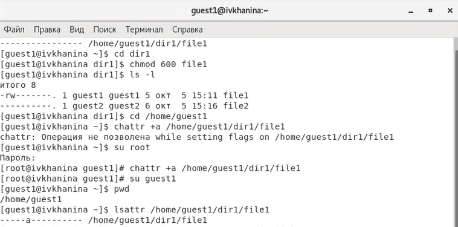
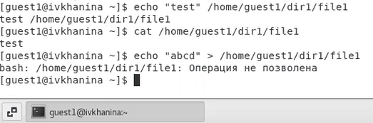
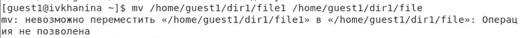
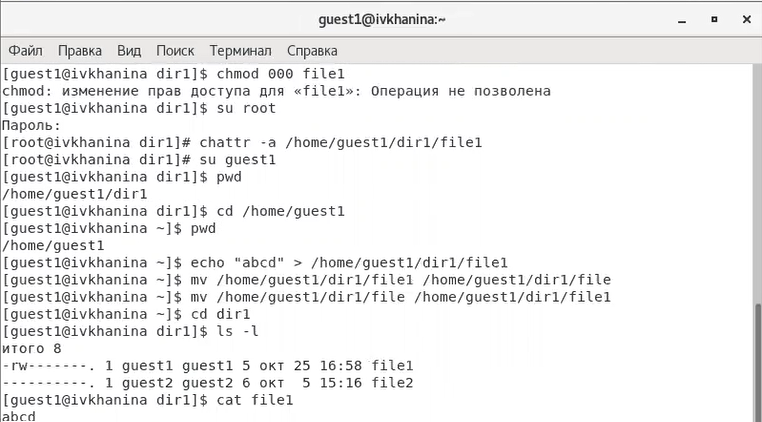
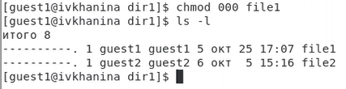
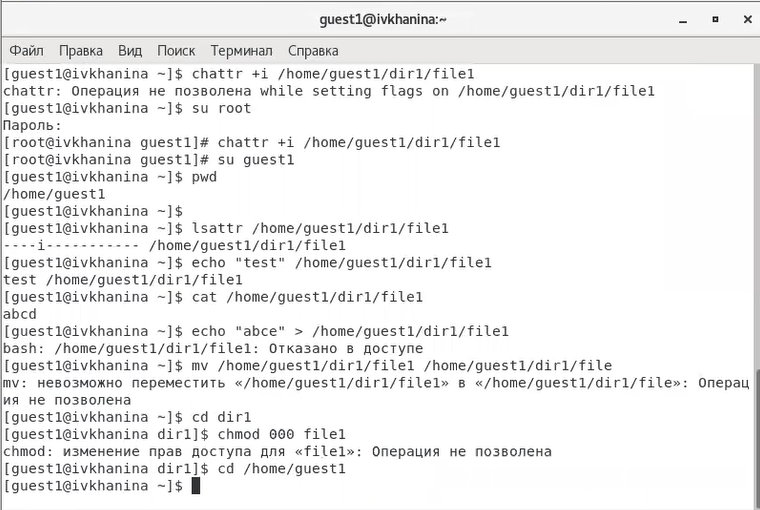
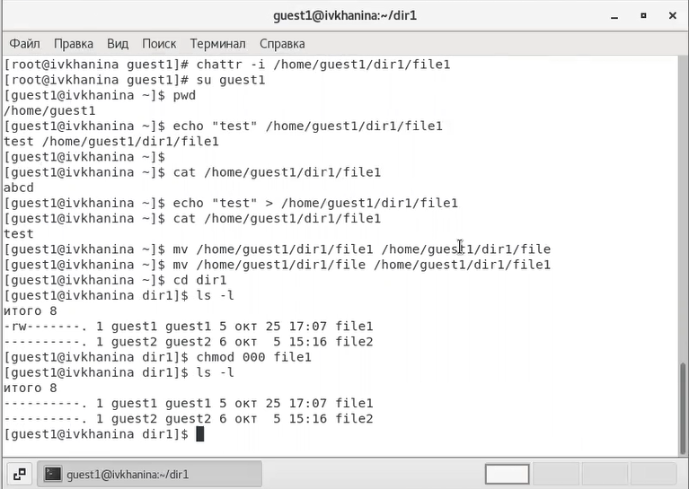

---
# Front matter
title: "Отчёт по лабораторной работе №3"
subtitle: "Дискреционное разграничение прав в Linux. Расширенные атрибуты"
author: "Ханина Ирина Владимировна, НБИбд-02-18"

# Generic otions
lang: ru-RU
toc-title: "Содержание"

# Bibliography
bibliography: bib/cite.bib
csl: pandoc/csl/gost-r-7-0-5-2008-numeric.csl

# Pdf output format
toc: true # Table of contents
toc_depth: 2
lof: true # List of figures
lot: true # List of tables
fontsize: 12pt
linestretch: 1.5
papersize: a4
documentclass: scrreprt
## I18n
polyglossia-lang:
  name: russian
  options:
	- spelling=modern
	- babelshorthands=true
polyglossia-otherlangs:
  name: english
### Fonts
mainfont: PT Serif
romanfont: PT Serif
sansfont: PT Sans
monofont: PT Mono
mainfontoptions: Ligatures=TeX
romanfontoptions: Ligatures=TeX
sansfontoptions: Ligatures=TeX,Scale=MatchLowercase
monofontoptions: Scale=MatchLowercase,Scale=0.9
## Biblatex
biblatex: true
biblio-style: "gost-numeric"
biblatexoptions:
  - parentracker=true
  - backend=biber
  - hyperref=auto
  - language=auto
  - autolang=other*
  - citestyle=gost-numeric
## Misc options
indent: true
header-includes:
  - \linepenalty=10 # the penalty added to the badness of each line within a paragraph (no associated penalty node) Increasing the value makes tex try to have fewer lines in the paragraph.
  - \interlinepenalty=0 # value of the penalty (node) added after each line of a paragraph.
  - \hyphenpenalty=50 # the penalty for line breaking at an automatically inserted hyphen
  - \exhyphenpenalty=50 # the penalty for line breaking at an explicit hyphen
  - \binoppenalty=700 # the penalty for breaking a line at a binary operator
  - \relpenalty=500 # the penalty for breaking a line at a relation
  - \clubpenalty=150 # extra penalty for breaking after first line of a paragraph
  - \widowpenalty=150 # extra penalty for breaking before last line of a paragraph
  - \displaywidowpenalty=50 # extra penalty for breaking before last line before a display math
  - \brokenpenalty=100 # extra penalty for page breaking after a hyphenated line
  - \predisplaypenalty=10000 # penalty for breaking before a display
  - \postdisplaypenalty=0 # penalty for breaking after a display
  - \floatingpenalty = 20000 # penalty for splitting an insertion (can only be split footnote in standard LaTeX)
  - \raggedbottom # or \flushbottom
  - \usepackage{float} # keep figures where there are in the text
  - \floatplacement{figure}{H} # keep figures where there are in the text
---

# Цель работы

Получение практических навыков работы в консоли с расширенными атрибутами файлов.

# Задание

Получить практические навыки работы в консоли с расширенными атрибутами файлов.

# Теоретическое введение

Система Linux - это типичная многопользовательская система, в которой разные пользователи находятся на разных позициях и имеют разные разрешения. 
Чтобы защитить безопасность системы, система Linux устанавливает разные права доступа к одному и тому же файлу (включая каталоги) для разных пользователей. 
Помимо прав доступа каждый из файлов стандартной файловой системы Linux имеет набор атрибутов, регламентирующих особенности работы с ним. Chattr - это команда в Linux, 
которая позволяет пользователю устанавливать и снимать определенные атрибуты файла. [[2]](https://en.wikipedia.org/wiki/Chattr) Доступны следующие атрибуты:

- a - файл может быть открыт только в режиме добавления;

- A - не обновлять время перезаписи;

- c - автоматически сжимать при записи на диск;

- C - отключить копирование при записи;

- D - работает только для папки, когда установлен, все изменения синхронно записываются на диск сразу же;

- e - использовать extent'ы блоков для хранения файла;

- i - сделать неизменяемым;

- j - все данные перед записью в файл будут записаны в журнал;

- s - безопасное удаление с последующей перезаписью нулями;

- S - синхронное обновление, изменения файлов с этим атрибутом будут сразу же записаны на диск;

- t - файлы с этим атрибутом не будут хранится в отдельных блоках;

- u - содержимое файлов с этим атрибутом не будет удалено при удалении самого файла и потом может быть восстановлено. [[1]](https://losst.ru/neizmenyaemye-fajly-v-linux)

# Выполнение лабораторной работы

1. От имени пользователя guest1 я определила расширенные атрибуты файла /home/guest1/dir1/file1 командой lsattr /home/guest1/dir1/file1. Затем я установила 
командой chmod 600 file1 на файл file1 права, разрешающие чтение и запись для владельца файла. Я попробовала установить на файл /home/guest1/dir1/file1 расширенный 
атрибут a от имени пользователя guest1 с помощью команды chattr +a /home/guest1/dir1/file1. В ответ я получила отказ от выполнения операции. Далее я зашла в систему 
от имени суперпользователя и попробовала установить расширенный атрибут a на файл /home/guest1/dir1/file1, введя команду chattr +a /home/guest1/dir1/file1. 
От пользователя guest1 проверила правильность установления атрибута, используя команду lsattr /home/guest1/dir1/file1. ([рис. 1](image/1.png))

{ #fig:001 width=70% }

2. Выполнила дозапись в файл file1 слова «test» командой echo "test" /home/guest1/dir1/file1 и выполнила чтение файла file1 командой cat /home/guest1/dir1/file1. Убедилась, 
что слово test было успешно записано в file1. Попробовала стереть имеющуюся в файле file1 информацию командой echo "abcd" > /home/guest1/dirl/file1. ([рис. 2](image/2.png)). 
Попробовала переименовать файл. Выполнить данные операции мне не удалось. ([рис. 3](image/3.png))

{ #fig:002 width=70% }

{ #fig:003 width=70% }

3. С помощью команды chmod 000 file1 я попробовала установить на файл file1 права, запрещающие чтение, запись и исполнение файла для владельца. Мне не удалось успешно выполнить 
указанные команды. Затем я сняла расширенный атрибут a с файла /home/guest1/dirl/file1 от имени суперпользователя, используя команду chattr -a /home/guest1/dir1/file1. Повторила операции, 
которые ранее мне не удавалось выполнить. ([рис. 4](image/4.png)). Я смогла стереть имеющуюся в файле file1 информацию командой echo "abcd" > /home/guest1/dirl/file1, переименовать файл с помощью команды mv 
/home/guest1/dirl/file1 /home/guest1/dirl/file, а также установить на файл file1 соответствующие права командой chmod 000 file1. ([рис. 5](image/5.png))

{ #fig:004 width=70% }

{ #fig:005 width=70% }

4. Затем я повторила свои действия по шагам, заменив атрибут «a» атрибутом «i». Мне не удалось дозаписать информацию в файл file1. ([рис. 6](image/6.png), [рис. 7](image/7.png))

{ #fig:006 width=70% }

{ #fig:007 width=70% }

# Выводы

В результате выполнения работы я повысила свои навыки использования интерфейса командой строки (CLI), познакомилась на примерах с тем, как используются основные и расширенные 
атрибуты при разграничении доступа. Также я имела возможность связать теорию дискреционного разделения доступа с её реализацией на практике в ОС Linux. 
Я приобрела практические навыки работы в консоли с расширенными атрибутами файлов «а» и «i».

# Список литературы{.unnumbered}

1. [КОМАНДА CHATTR В LINUX](https://losst.ru/neizmenyaemye-fajly-v-linux)
2. [chattr](https://en.wikipedia.org/wiki/Chattr)
