---
# Front matter
title: "Отчёт по лабораторной работе №5"
subtitle: "Дискреционное разграничение прав в Linux. Исследование влияния дополнительных атрибутов"
author: "Ханина Ирина Владимировна, НБИбд-02-18"

# Generic otions
lang: ru-RU
toc-title: "Содержание"

# Bibliography
bibliography: bib/cite.bib
csl: pandoc/csl/gost-r-7-0-5-2008-numeric.csl

# Pdf output format
toc: true # Table of contents
toc_depth: 2
lof: true # List of figures
lot: true # List of tables
fontsize: 12pt
linestretch: 1.5
papersize: a4
documentclass: scrreprt
## I18n
polyglossia-lang:
  name: russian
  options:
	- spelling=modern
	- babelshorthands=true
polyglossia-otherlangs:
  name: english
### Fonts
mainfont: PT Serif
romanfont: PT Serif
sansfont: PT Sans
monofont: PT Mono
mainfontoptions: Ligatures=TeX
romanfontoptions: Ligatures=TeX
sansfontoptions: Ligatures=TeX,Scale=MatchLowercase
monofontoptions: Scale=MatchLowercase,Scale=0.9
## Biblatex
biblatex: true
biblio-style: "gost-numeric"
biblatexoptions:
  - parentracker=true
  - backend=biber
  - hyperref=auto
  - language=auto
  - autolang=other*
  - citestyle=gost-numeric
## Misc options
indent: true
header-includes:
  - \linepenalty=10 # the penalty added to the badness of each line within a paragraph (no associated penalty node) Increasing the value makes tex try to have fewer lines in the paragraph.
  - \interlinepenalty=0 # value of the penalty (node) added after each line of a paragraph.
  - \hyphenpenalty=50 # the penalty for line breaking at an automatically inserted hyphen
  - \exhyphenpenalty=50 # the penalty for line breaking at an explicit hyphen
  - \binoppenalty=700 # the penalty for breaking a line at a binary operator
  - \relpenalty=500 # the penalty for breaking a line at a relation
  - \clubpenalty=150 # extra penalty for breaking after first line of a paragraph
  - \widowpenalty=150 # extra penalty for breaking before last line of a paragraph
  - \displaywidowpenalty=50 # extra penalty for breaking before last line before a display math
  - \brokenpenalty=100 # extra penalty for page breaking after a hyphenated line
  - \predisplaypenalty=10000 # penalty for breaking before a display
  - \postdisplaypenalty=0 # penalty for breaking after a display
  - \floatingpenalty = 20000 # penalty for splitting an insertion (can only be split footnote in standard LaTeX)
  - \raggedbottom # or \flushbottom
  - \usepackage{float} # keep figures where there are in the text
  - \floatplacement{figure}{H} # keep figures where there are in the text
---

# Цель работы

Изучение механизмов изменения идентификаторов, применения SetUID- и Sticky-битов. Получение практических навыков работы в консоли с дополнительными атрибутами. 
Рассмотрение работы механизма смены идентификатора процессов пользователей, а также влияние бита Sticky на запись и удаление файлов.

# Задание

Изучить механизмы изменения идентификаторов, применения SetUID- и Sticky-битов. Получить практические навыки работы в консоли с дополнительными атрибутами. 
Рассмотреть работу механизма смены идентификатора процессов пользователей, а также влияние бита Sticky на запись и удаление файлов.

# Теоретическое введение

Чтобы получить доступ к файлам и директориям в Linux, используются разрешения. Эти разрешения назначаются трем объектам: владельцу, группе и остальным пользователям. При 
создании файла или директории тот пользователь, от имени которого был создан файл или директория, становится его владельцем, а группой устанавливается основная группа владельца. 
Но владельца файла и группу можно менять, для этого используются команды chown. 

Система разрешений Linux была изобретена в 1970-х годах. Поскольку вычислительные потребности были ограничены в те годы, базовая система разрешений была довольно ограничена. 
Эта система разрешений использует три разрешения, которые можно применять к файлам и каталогам:

- r - разрешение на чтение;
- w - разрешение на запись;
- x - разрешение на выполнение. [[1]](https://habr.com/ru/post/469667/)

Помимо основных разрешений в Linux также есть набор расширенных разрешений:

- SUID - разрешение на установку идентификатора пользователя. Это бит разрешения, который позволяет пользователю запускать исполняемый файл с правами владельца этого файла. 
Другими словами, использование этого бита позволяет нам поднять привилегии пользователя в случае, если это необходимо.

- SGID - разрешение на установку идентификатора группы. Принцип работы очень похож на SUID с отличием, что файл будет запускаться пользователем от имени группы, 
которая владеет файлом.

- Sticky bit - в случае, если этот бит установлен для папки, то файлы в этой папке могут быть удалены только их владельцем. Пример использования этого бита в операционной 
системе - это системная папка /tmp . Эта папка разрешена на запись любому пользователю, но удалять файлы в ней могут только пользователи, являющиеся владельцами этих файлов. Когда 
вы применяете sticky bit, пользователь может удалять файлы, только если выполняется одно из следующих условий: пользователь является владельцем файл или пользователь является 
владельцем каталога, в котором находится файл. [[2]](https://ruvds.com/ru/helpcenter/suid-sgid-sticky-bit-linux/)

Чтобы применить SUID, SGID и sticky bit, можно использовать команду chmod. Для SUID используйте chmod u+s. Для SGID используйте chmod g+s. Для sticky bit используйте chmod +t, 
а затем имя файла или каталога, для которого вы хотите установить разрешения. [[1]](https://habr.com/ru/post/469667/)

# Выполнение лабораторной работы

1. Выполнила подготовку лабораторного стенда.  ([рис. 1](image/1.png))

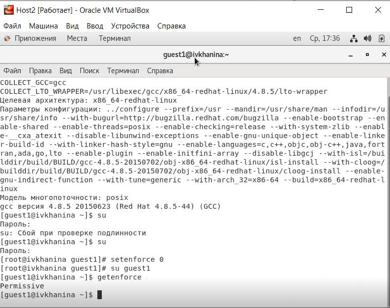{ #fig:001 width=70% }

2. Я вошла в систему от имени пользователя guest1 и создала программу simpleid.c. ([рис. 2](image/2.png)). 
Скомплилировала программу с помощью команды gcc simpleid.c -o simpleid и убедилась, что файл программы был создан. Выполнила программу simpleid. 
Затем я выполнила системную программу id и сравнила полученный результат: вывод uid и gid одинаковый. ([рис. 3](image/3.png))

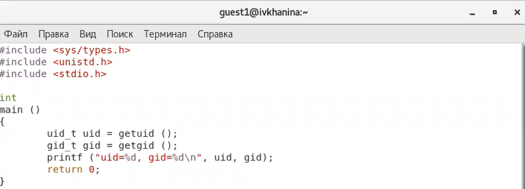{ #fig:002 width=70% }

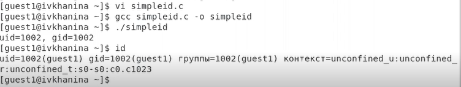{ #fig:003 width=70% }

3. Усложнила программу, добавив вывод действительных идентификаторов. Получившуюся программу назвала simpleid2.c. ([рис. 4](image/4.png)). 
Скомпилировала и запустила simpleid2.c. ([рис. 5](image/5.png)).

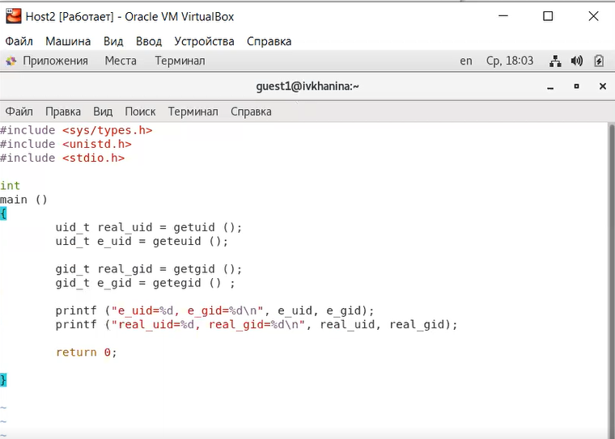{ #fig:004 width=70% }

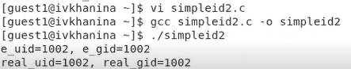{ #fig:005 width=70% }

4. От имени суперпользователя выполнила команды chown root:guest1 /home/guest1/simpleid2 и chmod u+s /home/guest1/simpleid2. 
Использовала команду su, чтобы временно повысить свои права. Выполнила проверку правильности установки новых атрибутов и смены владельца файла simpleid2, 
введя команду ls -l simpleid2. Запустила simpleid2 и id, сравнила результаты. Программа simpleid2 была запущена с правами суперпользователя - владьца файла, хотя 
действительный uid пользователя guest1 другой. ([рис. 6](image/6.png))

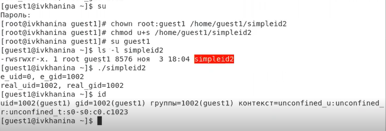{ #fig:006 width=70% }

5. Проделала те самые действия относительно SetGID-бита. ([рис. 7](image/7.png))

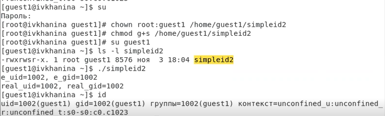{ #fig:007 width=70% }

6. Создала программу readfile.c. ([рис. 8](image/8.png)). Скомпилировала её при помощи команды gcc readfile.c -o readfile. ([рис. 9](image/9.png))

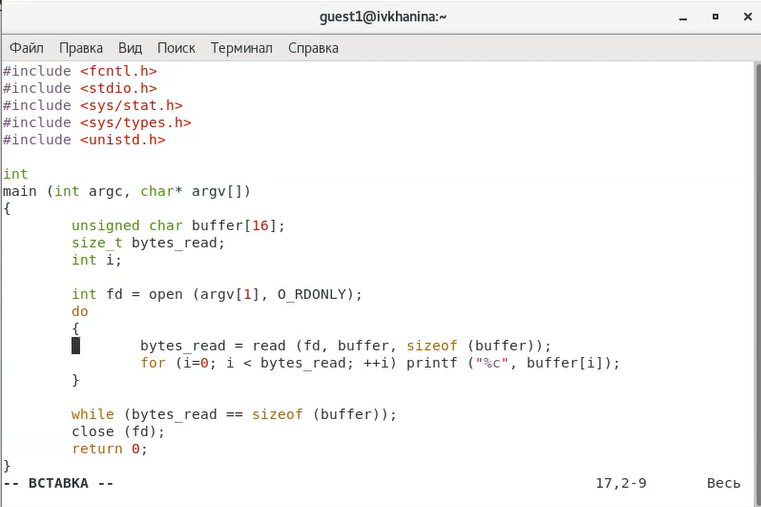{ #fig:008 width=70% }

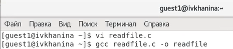{ #fig:009 width=70% }

7. Далее я сменила владельца у файла readfile.c и изменила права так, чтобы только суперпользователь (root) мог прочитать его, 
a guest1 не мог. После этого я проверила, что пользователь guest1 не может прочитать файл readfile.c. 
Сменила у программы readfile владельца и установила SetU’D-бит. ([рис. 10](image/10.png))

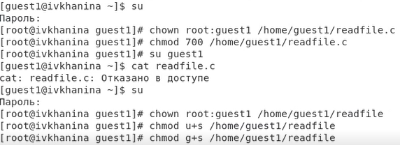{ #fig:010 width=70% }

8. Я проверила, может ли программа readfile прочитать файл readfile.c ([рис. 11](image/11.png)), а также может ли программа readfile прочитать файл /etc/shadow. ([рис. 12](image/12.png))
Программа смогла их прочитать. 

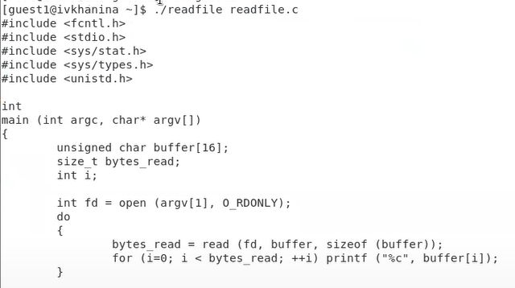{ #fig:011 width=70% }

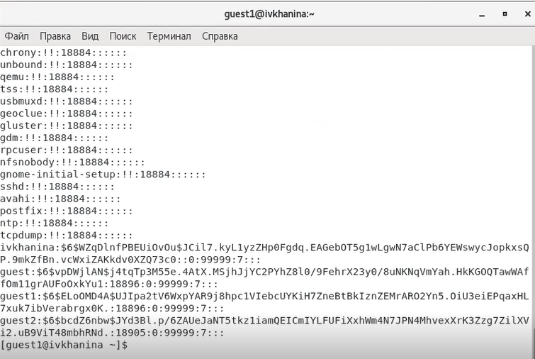{ #fig:012 width=70% }

9. Выяснила, установлен ли атрибут Sticky на директории /tmp, для чего выполнила команду ls -l / | grep tmp. Да, данный атрибут установлен. От имени пользователя guest1 
создала файл file01.txt в директории /tmp со словом test. Затем я просмотрела атрибуты у созданного файла и разрешила чтение и запись для категории пользователей 
«все остальные». От пользователя guest2 (не являющегося владельцем) попробовала прочитать файл /tmp/file01.txt, а так же сделать дозапись слова test2 в 
файл /tmp/file01.txt командой echo "test2" > /tmp/file01.txt. Мне удалось выполнить операцию. Далее я распечатала содержимое файла командой cat /tmp/file01.txt. 
От пользователя guest2 попробовала записать в файл /tmp/file01.txt слово test3, стерев при этом всю имеющуюся в файле информацию командой echo "test3" > /tmp/file01.txt. 
Я смогла это сделать. Затем я проверила содержимое файла командой cat /tmp/file01.txt.([рис. 13](image/13.png))

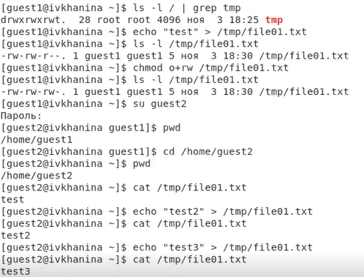{ #fig:013 width=70% }

10. От пользователя guest2 попробовала удалить файл /tmp/file01.txt командой rm /tmp/fileOl.txt. Я не смогла удалить файл. Повысила свои права до суперпользователя, 
введя команду su -, и выполните после этого команду chmod -t /tmp. Покинула режим суперпользователя командой exit, после чего 
от пользователя guest2 проверила, что атрибута t у директории /tmp нет. Повторила предыдущие шаги. Мне удалось удалить файл от имени пользователя, не являющегося его 
владельцем. ([рис. 14](image/14.png)).

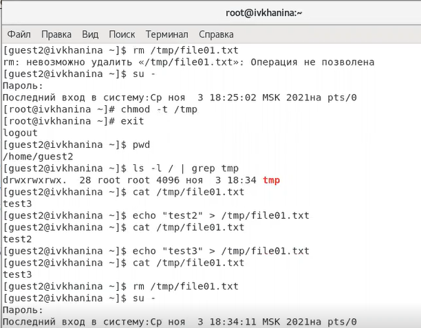{ #fig:014 width=70% }

12. Я вновь повысила свои права до суперпользователя и вернула атрибут t на директорию /tmp. ([рис. 15](image/15.png))

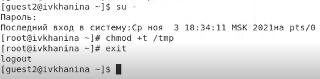{ #fig:015 width=70% }

# Выводы

В результате выполнения лабораторной работы я изучила механизмы изменения идентификаторов, применения SetUID- и Sticky-битов, получила практические навыки работы в консоли 
с дополнительными атрибутами, рассмотрела работу механизма смены идентификатора процессов пользователей, а также влияние бита Sticky на запись и удаление файлов.

# Список литературы{.unnumbered}

1. [Права в Linux (chown, chmod, SUID, GUID, sticky bit, ACL, umask)](https://habr.com/ru/post/469667/)

2. [Использование SETUID, SETGID и Sticky bit для расширенной настройки прав доступа в операционных системах Linux](https://ruvds.com/ru/helpcenter/suid-sgid-sticky-bit-linux/)
