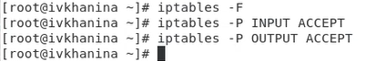
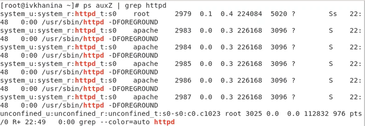
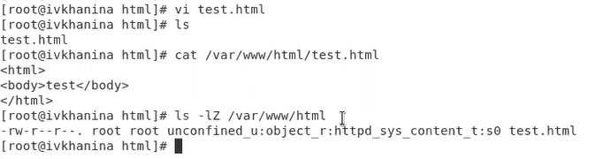

---
# Front matter
title: "Отчёт по лабораторной работе №6"
subtitle: "Мандатное разграничение прав в Linux"
author: "Ханина Ирина Владимировна, НБИбд-02-18"

# Generic otions
lang: ru-RU
toc-title: "Содержание"

# Bibliography
bibliography: bib/cite.bib
csl: pandoc/csl/gost-r-7-0-5-2008-numeric.csl

# Pdf output format
toc: true # Table of contents
toc_depth: 2
lof: true # List of figures
lot: true # List of tables
fontsize: 12pt
linestretch: 1.5
papersize: a4
documentclass: scrreprt
## I18n
polyglossia-lang:
  name: russian
  options:
	- spelling=modern
	- babelshorthands=true
polyglossia-otherlangs:
  name: english
### Fonts
mainfont: PT Serif
romanfont: PT Serif
sansfont: PT Sans
monofont: PT Mono
mainfontoptions: Ligatures=TeX
romanfontoptions: Ligatures=TeX
sansfontoptions: Ligatures=TeX,Scale=MatchLowercase
monofontoptions: Scale=MatchLowercase,Scale=0.9
## Biblatex
biblatex: true
biblio-style: "gost-numeric"
biblatexoptions:
  - parentracker=true
  - backend=biber
  - hyperref=auto
  - language=auto
  - autolang=other*
  - citestyle=gost-numeric
## Misc options
indent: true
header-includes:
  - \linepenalty=10 # the penalty added to the badness of each line within a paragraph (no associated penalty node) Increasing the value makes tex try to have fewer lines in the paragraph.
  - \interlinepenalty=0 # value of the penalty (node) added after each line of a paragraph.
  - \hyphenpenalty=50 # the penalty for line breaking at an automatically inserted hyphen
  - \exhyphenpenalty=50 # the penalty for line breaking at an explicit hyphen
  - \binoppenalty=700 # the penalty for breaking a line at a binary operator
  - \relpenalty=500 # the penalty for breaking a line at a relation
  - \clubpenalty=150 # extra penalty for breaking after first line of a paragraph
  - \widowpenalty=150 # extra penalty for breaking before last line of a paragraph
  - \displaywidowpenalty=50 # extra penalty for breaking before last line before a display math
  - \brokenpenalty=100 # extra penalty for page breaking after a hyphenated line
  - \predisplaypenalty=10000 # penalty for breaking before a display
  - \postdisplaypenalty=0 # penalty for breaking after a display
  - \floatingpenalty = 20000 # penalty for splitting an insertion (can only be split footnote in standard LaTeX)
  - \raggedbottom # or \flushbottom
  - \usepackage{float} # keep figures where there are in the text
  - \floatplacement{figure}{H} # keep figures where there are in the text
---

# Цель работы

Развить навыки администрирования ОС Linux. Получить первое практическое знакомство с технологией SELinux. Проверить работу SELinux на практике совместно с веб-сервером Apache.

# Задание

Формулировка задания представлена в разделе 6.4 "Порядок выполнения работы" в файле "Лабораторная работа № 6. Описание".

# Теоретическое введение

Linux с улучшенной безопасностью (SELinux) - это механизм безопасности с мандатной моделью контроля доступа (MAC), реализованный в ядре. Это разграничение контроля 
доступа внедряется поверх того, что уже есть в каждом дистрибутиве Linux, DAC (Discretionary Access Control). Можно сказать, что SELinux расширяет возможности 
стандартной системы безопасности. Первоначально он был разработан Агентством национальной безопасности США для защиты компьютерных систем от вторжения злоумышленников и взлома. 
Со временем SELinux появился в открытом доступе, и тогда различные дистрибутивы включили его в свой код. Он был впервые представлен в CentOS 4 и значительно улучшен в 
более поздних выпусках CentOS. [[1]](https://wiki.centos.org/HowTos/SELinux)

Система SELinux – это средство для точной настройки требований контроля доступа. С помощью SELinux можно определить, что позволено делать пользователю или процессу. 
Она ограничивает каждый процесс своим собственным доменом, поэтому процесс может взаимодействовать только с определенными типами файлов и другими процессами из 
разрешенных доменов. Это предотвращает взлом любого процесса и получение хакерами общесистемного доступа. [[3]](https://www.8host.com/blog/vvedenie-v-selinux-v-centos-7-bazovye-ponyatiya/)

SELinux имеет три основных режим работы:

- Enforcing: Режим по-умолчанию. При выборе этого режима все действия, которые каким-то образом нарушают текущую политику безопасности, будут блокироваться, а 
попытка нарушения будет зафиксирована в журнале.

- Permissive: В случае использования этого режима, информация о всех действиях, которые нарушают текущую политику безопасности, будут зафиксированы в журнале, 
но сами действия не будут заблокированы.

- Disabled: Полное отключение системы принудительного контроля доступа. [[2]](https://habr.com/ru/company/kingservers/blog/209644/)

Для просмотра текущего режима и других настроек SELinux используется команда sestatus. Узнать статус SELinux можно при помощи команды getenforce. Команда setenforce позволяет 
быстро переключаться между режимами Enforcing и Permissive, изменения вступают в силу без перезагрузки. Но если вы включаете или отключаете SELinux, требуется перезагрузка, 
ведь нужно заново устанавливать метки безопасности в файловой системе. [[3]](https://www.8host.com/blog/vvedenie-v-selinux-v-centos-7-bazovye-ponyatiya/)

# Выполнение лабораторной работы

1. Выполнила подготовку лабораторного стенда: вошла в систему от имени суперпользователя и запустила команду для установки веб-сервера Apache: yum install httpd ([рис. 1](image/1.png)), 
задала параметр ServerName в конфигурационном файле /etc/httpd/httpd.conf ([рис. 2](image/2.png)), отключила пакетный фильтр командами iptables -F, iptables -P INPUT ACCEPT и iptables -P OUTPUT ACCEPT. ([рис. 3](image/3.png)) 

{ #fig:001 width=70% }

{ #fig:002 width=70% }

{ #fig:003 width=70% }

2. Я вошла в систему и убедилась, что SELinux работает в режиме enforcing политики targeted с помощью команд getenforce и sestatus. ([рис. 4](image/4.png)). Далее с помощью команды 
service httpd status я обратилась с помощью браузера к веб-серверу, запущенному на компьютере, и убедилась, что он работает. ([рис. 5](image/5.png))

{ #fig:004 width=70% }

{ #fig:005 width=70% }

3. Затем я нашла веб-сервер Apache в списке процессов и определила его контекст безопасности, используя команду ps auxZ | grep httpd. ([рис. 6](image/6.png))

{ #fig:006 width=70% }

4. Я посмотрела текущее состояние переключателей SELinux для Apache с помощью команды sestatus -bigrep httpd и обратила внимание, что многие из них находятся в положении «off». ([рис. 7](image/7.png))

{ #fig:007 width=70% }

5. Я посмотрела статистику по политике с помощью команды seinfo, также определила множество пользователей, ролей, типов. Затем я определила тип файлов и поддиректорий, 
находящихся в директории /var/www, с помощью команды ls -lZ /var/www. А потом определила тип файлов, находящихся в директории /var/www/html, введя команду ls -lZ /var/www/html. 
Определила круг пользователей, которым разрешено создание файлов в директории /var/www/html. ([рис. 8](image/8.png))

{ #fig:008 width=70% }

6. Далее от имени суперпользователя я создала html-файл /var/www/html/test.html. Проверила контекст созданного файла. ([рис. 9](image/9.png))

{ #fig:009 width=70% }

7. Обратилась к файлу через веб-сервер, введя в браузере адрес http://127.0.0.1/test.html. Убедилась, что файл был успешно отображён. ([рис. 10](image/10.png))

{ #fig:010 width=70% }

8. Я изучила справку man httpd_selinux и выяснила, какие контексты файлов определены для httpd. Затем я сопоставила их с типом файла test.html. 
Проверила контекст файла с помощью команды ls -Z /var/www/html/test.html. Я изменила контекст файла /var/www/html/test.html с httpd_sys_content_t на 
samba_share_t командами chcon -t samba_share_t /var/www/html/test.html и ls -Z /var/www/html/test.html. Проверила, контекст поменялся. ([рис. 11](image/11.png))

{ #fig:011 width=70% }

9. Попробовала ещё раз получить доступ к файлу через веб-сервер, введя в браузере адрес http://127.0.0.1/test.html и получила сообщение об ошибке. 
Из-за смены контекста доступ к файлу запрщен. ([рис. 12](image/12.png))

{ #fig:012 width=70% }

10. Я просмотрела log-файлы веб-сервера Apache, а также системный лог-файл: tail /var/log/messages. ([рис. 13](image/13.png))

{ #fig:013 width=70% }

11. Попробовала запустить веб-сервер Apache на прослушивание ТСР-порта 81. Для этого в файле /etc/httpd/httpd.conf нашла строчку Listen 80 и заменила её на Listen 81. ([рис. 14](image/14.png))

{ #fig:014 width=70% }

12. Перезапустила веб-сервер Apache. Проанализировала лог-файлы: tail -nl /var/log/messages. Просмотрела файлы /var/log/http/error_log, /var/log/http/access_log и /var/log/audit/audit.log и выяснила, 
в каких файлах появились записи. ([рис. 15](image/15.png))

{ #fig:015 width=70% }

13. Выполнила команду semanage port -a -t http_port_t -р tcp 81. После этого проверила список портов командой semanage port -l | grep http_port_t. Убедителась, что порт 81 
появился в списке. Запустила веб-сервер Apache ещё раз. ([рис. 16](image/16.png))

{ #fig:016 width=70% }

14. Вернула контекст httpd_sys_cоntent__t к файлу /var/www/html/test.html командами chcon -t httpd_sys_content_t /var/www/html/test.html. ([рис. 17](image/17.png))

{ #fig:017 width=70% }

15. После этого попробовала получить доступ к файлу через веб-сервер, введя в браузере адрес http://127.0.0.1:81/test.html. Я увидела содержимое файла — слово «test». ([рис. 18](image/18.png))

{ #fig:018 width=70% }

16. Исправила обратно конфигурационный файл apache, вернув Listen 80. ([рис. 19](image/19.png))

{ #fig:019 width=70% }

24. Удалила привязку http_port_t к 81 порту с помощью команды semanage port -d -t http_port_t -p tcp 81 и проверила, что порт 81 удалён. 
Удалила файл /var/www/html/test.html командой /rm /var/www/html/test.html. ([рис. 20](image/20.png))

{ #fig:020 width=70% }

# Выводы

В результате выполнения лабораторной работы я развила навыки администрирования ОС Linux, получила первое практическое знакомство с технологией SELinux,
а также проверить работу SELinux на практике совместно с веб-сервером Apache.

# Список литературы{.unnumbered}

1. [SELinux](https://wiki.centos.org/HowTos/SELinux)

2. [SELinux – описание и особенности работы с системой](https://habr.com/ru/company/kingservers/blog/209644/)

3. [ВВЕДЕНИЕ В SELINUX В CENTOS 7: БАЗОВЫЕ ПОНЯТИЯ](https://www.8host.com/blog/vvedenie-v-selinux-v-centos-7-bazovye-ponyatiya/)
