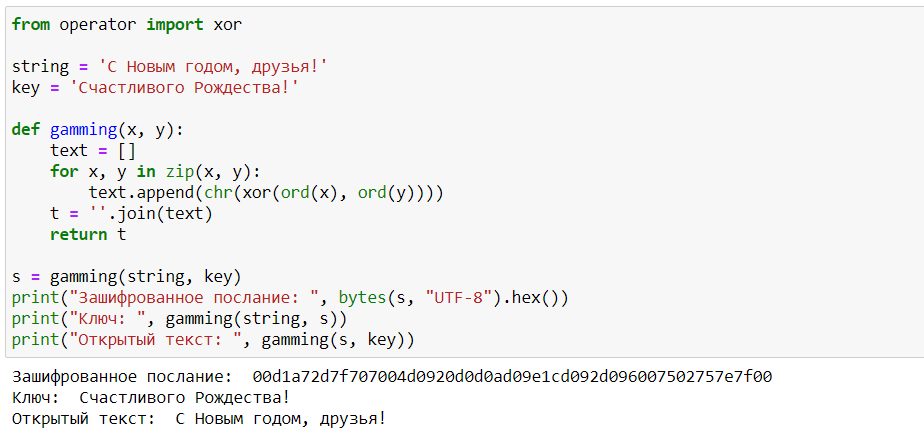

---
## Front matter
lang: ru-RU
title: Элементы криптографии. Однократное гаммирование
author: Ханина Ирина Владимировна НБИбд-02-18
institute: Российский Университет Дружбы Народов
date: 9 декабря, 2021, Москва, Россия

## Formatting
mainfont: PT Serif
romanfont: PT Serif
sansfont: PT Sans
monofont: PT Mono
toc: false
slide_level: 2
theme: metropolis
header-includes: 
 - \metroset{progressbar=frametitle,sectionpage=progressbar,numbering=fraction}
 - '\makeatletter'
 - '\beamer@ignorenonframefalse'
 - '\makeatother'
aspectratio: 43
section-titles: true

---

## Теоретическое введение 

Гаммирование или Шифр XOR - это наложение (снятие) на открытые (зашифрованные) данные последовательности элементов других данных, полученной с помощью некоторого криптографического 
алгоритма, для получения зашифрованных (открытых) данных. С точки зрения теории криптоанализа метод шифрования однократной вероятностной гаммой (однократного гаммирования) 
той же длины, что и открытый текст, является невскрываемым. Наложение гаммы представляет собой выполнение операции сложения по модулю 2 (XOR) между элементами 
гаммы и элементами подлежащего сокрытию текста. Данный метод шифрования - симметричный, т.к. двойное прибавление одной и той же величины по модулю 2 восстанавливает 
исходное значение, а шифрование и расшифрование выполняется одной и той же программой.

## Цель лабораторной работы

Цель - освоить на практике применение режима однократного гаммирования.

## Задачи лабораторной работы

Подобрать ключ, чтобы получить сообщение «С Новым Годом, друзья!». Далее разработать приложение, позволяющее шифровать и дешифровать данные в 
режиме однократного гаммирования. Приложение должно:

1. Определить вид шифротекста при известном ключе и известном открытом тексте.

2. Определить ключ, с помощью которого шифротекст может быть преобразован в некоторый фрагмент текста, представляющий собой один из возможных вариантов прочтения открытого текста.

## Результаты выполнения лабораторной работы

Я освоила на практике применение режима однократного гаммирования. Код программы:

{ #fig:002 width=70% }