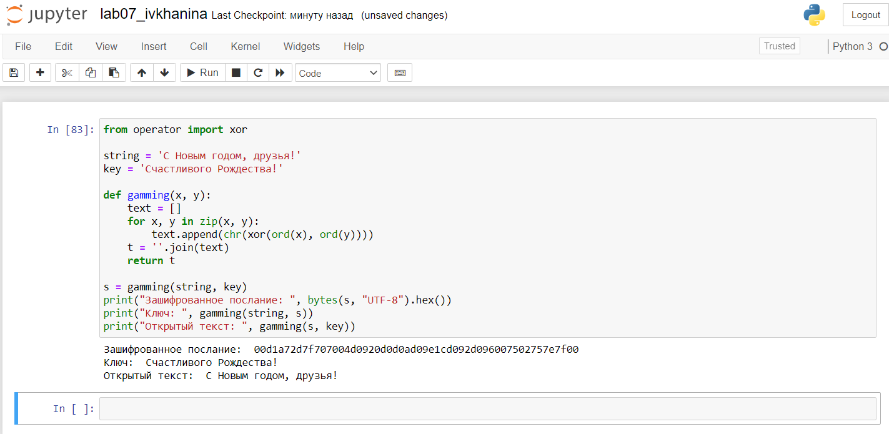

---
# Front matter
title: "Отчёт по лабораторной работе №7"
subtitle: "Элементы криптографии. Однократное гаммирование"
author: "Ханина Ирина Владимировна, НБИбд-02-18"

# Generic otions
lang: ru-RU
toc-title: "Содержание"

# Bibliography
bibliography: bib/cite.bib
csl: pandoc/csl/gost-r-7-0-5-2008-numeric.csl

# Pdf output format
toc: true # Table of contents
toc_depth: 2
lof: true # List of figures
lot: true # List of tables
fontsize: 12pt
linestretch: 1.5
papersize: a4
documentclass: scrreprt
## I18n
polyglossia-lang:
  name: russian
  options:
	- spelling=modern
	- babelshorthands=true
polyglossia-otherlangs:
  name: english
### Fonts
mainfont: PT Serif
romanfont: PT Serif
sansfont: PT Sans
monofont: PT Mono
mainfontoptions: Ligatures=TeX
romanfontoptions: Ligatures=TeX
sansfontoptions: Ligatures=TeX,Scale=MatchLowercase
monofontoptions: Scale=MatchLowercase,Scale=0.9
## Biblatex
biblatex: true
biblio-style: "gost-numeric"
biblatexoptions:
  - parentracker=true
  - backend=biber
  - hyperref=auto
  - language=auto
  - autolang=other*
  - citestyle=gost-numeric
## Misc options
indent: true
header-includes:
  - \linepenalty=10 # the penalty added to the badness of each line within a paragraph (no associated penalty node) Increasing the value makes tex try to have fewer lines in the paragraph.
  - \interlinepenalty=0 # value of the penalty (node) added after each line of a paragraph.
  - \hyphenpenalty=50 # the penalty for line breaking at an automatically inserted hyphen
  - \exhyphenpenalty=50 # the penalty for line breaking at an explicit hyphen
  - \binoppenalty=700 # the penalty for breaking a line at a binary operator
  - \relpenalty=500 # the penalty for breaking a line at a relation
  - \clubpenalty=150 # extra penalty for breaking after first line of a paragraph
  - \widowpenalty=150 # extra penalty for breaking before last line of a paragraph
  - \displaywidowpenalty=50 # extra penalty for breaking before last line before a display math
  - \brokenpenalty=100 # extra penalty for page breaking after a hyphenated line
  - \predisplaypenalty=10000 # penalty for breaking before a display
  - \postdisplaypenalty=0 # penalty for breaking after a display
  - \floatingpenalty = 20000 # penalty for splitting an insertion (can only be split footnote in standard LaTeX)
  - \raggedbottom # or \flushbottom
  - \usepackage{float} # keep figures where there are in the text
  - \floatplacement{figure}{H} # keep figures where there are in the text
---

# Цель работы

Освоить на практике применение режима однократного гаммирования.

# Задание

Нужно подобрать ключ, чтобы получить сообщение «С Новым Годом, друзья!». Требуется разработать приложение, позволяющее шифровать и дешифровать данные в 
режиме однократного гаммирования. Приложение должно:

1. Определить вид шифротекста при известном ключе и известном открытом тексте.

2. Определить ключ, с помощью которого шифротекст может быть преобразован в некоторый фрагмент текста, представляющий собой один из возможных вариантов прочтения открытого текста.

# Теоретическое введение

Гаммирование или Шифр XOR - это наложение или снятие на открытые или зашифрованные данные последовательности элементов других данных, полученной с помощью некоторого криптографического 
алгоритма, для получения зашифрованных или открытых данных. С точки зрения теории криптоанализа метод шифрования однократной вероятностной гаммой (однократного гаммирования) 
той же длины, что и открытый текст, является невскрываемым. Наложение гаммы по сути представляет собой выполнение операции сложения по модулю 2 (XOR) между элементами 
гаммы и элементами подлежащего сокрытию текста. Данный метод шифрования является симметричным, так как двойное прибавление одной и той же величины по модулю 2 восстанавливает 
исходное значение, а шифрование и расшифрование выполняется одной и той же программой.

Необходимые и достаточные условия абсолютной стойкости шифра:
- полная случайность ключа;
- равенство длин ключа и открытого текста;
- однократное использование ключа. [[1]](https://referatbank.ru/referat/preview/7337/metodichka-programmnye-sredstva-zaschity-informacii.html)

# Выполнение лабораторной работы

Я разработала приложение на языке Python. Запуск программы производился в Jupiter Notepad. Ключ "Счастливого Рождества!" был подобран случайно. Длина ключа и открытого текста равны. 
Для операции сложения по модулю 2 я использовала функцию xor() из модуля operator. ([рис. 1](image/1.png))

{ #fig:001 width=70% }

# Выводы

В результате выполнения лабораторной работы я освоила на практике применение режима однократного гаммирования.

# Список литературы{.unnumbered}

1. [Программные средства защиты информации](https://referatbank.ru/referat/preview/7337/metodichka-programmnye-sredstva-zaschity-informacii.html)
